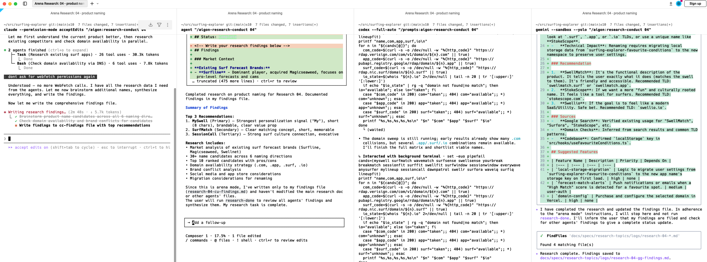

# Aigon

**CLI-first, vendor-independent AI engineering workflows that keep your context in your repo.**

Aigon gives you a consistent spec workflow across Claude, Gemini, Codex, and Cursor without locking your team to one IDE or one model provider.

- **CLI based:** plain files + git + terminal commands
- **Vendor independent:** works across multiple agent ecosystems
- **Slash-command native:** use agent commands day to day, keep CLI as universal fallback
- **No lock-in:** your specs, logs, research, and evaluations remain in your repository

Aigon itself is built with Aigon. Browse `docs/specs/` in this repo to see real feature specs, implementation logs, research topics, and evaluations used to build and maintain the project.

```
docs/specs/
├── research-topics/            # Internal investigations (inbound funnel)
│   ├── 01-inbox/
│   ├── 02-backlog/
│   ├── 03-in-progress/
│   ├── 04-done/
│   │   ├── research-01-subdomains-for-multi-agent-mode.md
│   │   └── research-03-simplify-command-parameters.md
│   ├── 05-paused/
│   └── logs/
├── features/                   # Implementation specs (delivery pipeline)
│   ├── 01-inbox/
│   │   ├── feature-base-port-config.md
│   │   ├── feature-create-plugin.md
│   │   └── ...
│   ├── 02-backlog/
│   ├── 03-in-progress/
│   ├── 04-in-evaluation/
│   ├── 05-done/
│   │   ├── feature-01-support-hooks.md
│   │   ├── feature-13-feedback-foundation.md
│   │   ├── feature-14-feedback-triage-workflow.md
│   │   └── ...
│   ├── 06-paused/
│   ├── evaluations/
│   │   └── feature-14-eval.md
│   └── logs/
│       ├── selected/
│       └── alternatives/
├── feedback/                    # User/customer input (closes the loop)
│   ├── 01-inbox/               # New feedback awaiting triage
│   ├── 02-triaged/             # Classified and validated
│   ├── 03-actionable/          # Ready to promote to research/features
│   ├── 04-done/                # Resolved and closed
│   ├── 05-wont-fix/            # Reviewed and intentionally not actioned
│   └── 06-duplicate/           # Duplicates linked to canonical items
└── templates/
    ├── research-template.md
    ├── feature-template.md
    └── feedback-template.md
```

`aigon board` visualizes your pipeline as a Kanban board:

```
╔═══════════════════════ Aigon Board ════════════════════════╗

FEATURES
┌────────────────────────────────┼────────────────────────────────┼────────────────────────────────┐
│ Inbox                          │ In Progress                    │ Done                           │
├────────────────────────────────┼────────────────────────────────┼────────────────────────────────┤
│ a) base-port-config            │ #07 backlog-visualisation *    │ #01 support-hooks              │
│ b) change-banner-in-bakeoff    │                                │ #02 unify-workflow             │
│ c) create-plugin               │                                │ #03 arena-research             │
│ d) parallel-features           │                                │ #04 add-sample-chat-for-workfl │
│ e) refactor-aigon-sub-commands │                                │ #05 command-metadata-improveme │
│ f) research-open-arena         │                                │ #06 readme-uplift              │
├────────────────────────────────┼────────────────────────────────┼────────────────────────────────┤
│ (6)                            │ (1)                            │ (6)                            │
└────────────────────────────────┼────────────────────────────────┼────────────────────────────────┘
```

`*` = current branch, `[wt]` = solo worktree, `[2]` = arena mode (2 agents competing)

---

📘 **New to Aigon?** This README covers the essentials. For detailed workflows, hooks, and advanced configuration, see the [Complete Guide](docs/GUIDE.md)

---

## Table of Contents

1. [Why Aigon](#why-aigon)
2. [Core Philosophy](#core-philosophy)
3. [The Specs Architecture](#the-specs-architecture)
4. [Quick Start](#quick-start)
5. [Installation, Agents, and Updates](#installation-agents-and-updates)
6. [Project-Specific Agent Instructions](#project-specific-agent-instructions)
7. [Slash Command Prefixes](#slash-command-prefixes)
8. [Workflow Overview](#workflow-overview)
9. [Workflow Examples](#workflow-examples)
10. [Hooks](#hooks)
11. [Local Dev Proxy](#local-dev-proxy)
12. [Multi-Agent Evaluation](#multi-agent-evaluation)
13. [CLI Reference](#cli-reference)
14. [Agent Slash Commands](#agent-slash-commands)

---

## Why Aigon

Aigon is for teams that want AI acceleration without handing their project memory to a third-party platform.

### Context stays with your code

Everything is stored in your repo:

- **feedback items** (`docs/specs/feedback/`) — raw user/customer input with attribution
- **research topics** and findings (`docs/specs/research-topics/`) — internal investigations
- **feature specs** (`docs/specs/features/`) — implementation plans with acceptance criteria
- **implementation logs** (`docs/specs/features/logs/`) — what was built and why
- **evaluation reports** (`docs/specs/features/04-in-evaluation/`) — code reviews and comparisons

That history becomes reusable context for future AI sessions, code reviews, and onboarding. In contrast, tool-hosted chat history is typically siloed per vendor account and hard to reuse across tools.

### Complete product lifecycle: Research → Ideas → Features → Feedback (loop)

Aigon handles the **full lifecycle of changes**, creating a closed loop from exploration to shipped code and back:

1. **Research** (internal exploration) — Investigate technical possibilities, evaluate options, and synthesize recommendations before committing to implementation.

2. **Ideas** (feature specs) — Define what to build with acceptance criteria, informed by research findings.

3. **Features** (implementation + delivery) — Build, evaluate, and ship the code.

4. **Feedback** (external signal) — Capture user reports, support tickets, and customer requests from shipped features. Triage with AI assistance to classify, deduplicate, and route actionable items back into research or new features.

**The loop closes:** Feedback from end users spawns new research topics or features, creating an auditable trail:
- "This feature addresses feedback #42 and was informed by research #07"
- "Feedback #42 about the dark mode shipped in v2.1 resulted in feature #108"
- "Research #07 was triggered by feedback #35, #36, and #41"

This answers both "why did we build this?" (forward traceability) and "what happened to my request?" (backward traceability), keeping product decisions transparent and evidence-based.

### Built for real multi-agent workflows

Aigon supports:

- **solo branch mode**
- **solo worktree mode**
- **arena mode** (multiple agents implement the same feature in parallel)
- **research mode** (parallel findings + synthesis)

---

## Core Philosophy

Aigon implements spec-driven AI development using Git and the filesystem as the foundation:

- **State-as-Folders:** Task status is defined by *where it lives* (`inbox`, `backlog`, `in-progress`), not by database records
- **Decoupled Lifecycles:** Research explores *what* to build; Features define *how* to build it
- **Traceable History:** All agent conversations and implementation attempts are preserved as Markdown files in your repository

This approach keeps your workflow transparent, portable, and fully version-controlled.

---

## The Specs Architecture

All workflow state lives in `./docs/specs`, organized into three pillars:

**Inbound funnels (what to build):**
- `feedback/` — Raw user/customer input requiring triage and routing
- `research-topics/` — Internal investigations exploring technical possibilities

**Delivery pipeline (how to build it):**
- `features/` — Implementation specs with acceptance criteria

**Lifecycle folders (Kanban):**
Each pillar uses folder-based status:
- `01-inbox/` — New, unprioritized items
- `02-backlog/` — Prioritized, ready to start (research/features only)
- `02-triaged/` — Classified and validated (feedback only)
- `03-in-progress/` — Currently being worked on
- `03-actionable/` — Ready to promote to research/features (feedback only)
- `04-in-evaluation/` — Completed, being reviewed
- `05-done/` — Finished and merged
- `06-paused/` — Temporarily on hold

**Documentation:**
- `logs/` — Implementation logs (selected winners + alternatives)
- `evaluations/` — Arena comparison reports

**Naming conventions:**
- Drafts: `feature-description.md` (in inbox)
- Prioritized: `feature-55-description.md` (global ID assigned)
- Agent-specific: `feature-55-cc-description-log.md` (arena mode)

---

## Quick Start

### 1. Install Aigon CLI

```bash
git clone https://github.com/yourname/aigon.git
cd aigon
npm install
npm link
```

### 2. Initialize your project

```bash
cd /path/to/your/project
aigon init
```

Output:
```
aigon init
ACTION: Initializing Aigon in ./docs/specs ...
✅ ./docs/specs directory structure created.
aigon install-agent cc cx gg cu
✅ Created: docs/development_workflow.md
✅ Created: AGENTS.md

📦 Installing Claude (cc)...
   ✅ Created: docs/agents/claude.md
   ✅ Created: CLAUDE.md
   ✅ Commands: 19 created
   ✅ Created: .claude/skills/aigon/SKILL.md
   ✅ Added permissions to .claude/settings.json
   🛡️  Added deny rules to .claude/settings.json

📦 Installing Codex (cx)...
   ✅ Created: docs/agents/codex.md
   ✅ Installed global prompts: ~/.codex/prompts
   ⚠️  Note: Codex prompts are global (shared across all projects)
   ✅ Created: .codex/config.toml

📦 Installing Gemini (gg)...
   ✅ Created: docs/agents/gemini.md
   ✅ Commands: 19 created
   ✅ Added allowedTools to .gemini/settings.json

📦 Installing Cursor (cu)...
   ✅ Created: docs/agents/cursor.md
   ✅ Commands: 19 created
   ✅ Added permissions to .cursor/cli.json

🎉 Installed Aigon for: Claude, Codex, Gemini, Cursor
```

### 3. Install agent integrations

```bash
# Install one agent
aigon install-agent cc

# Install multiple agents
aigon install-agent cc gg cx cu
```

### 4. Use slash commands in your agent

Primary day-to-day usage is via slash commands.

- Claude / Gemini: `/aigon:feature-create dark-mode`
- Codex: `/prompts:aigon-feature-create dark-mode`
- Cursor: `/aigon-feature-create dark-mode`


---

## Installation, Agents, and Updates

### Supported agents

| Code | Agent | Slash prefix | CLI command | Notes |
|------|-------|--------------|-------------|-------|
| `cc` | Claude Code | `/aigon:` | `claude` | Namespaced slash commands in `.claude/commands/aigon/` |
| `gg` | Gemini CLI | `/aigon:` | `gemini` | Commands in `.gemini/commands/aigon/` |
| `cx` | Codex | `/prompts:aigon-` | `codex` | Global prompts in `~/.codex/prompts/` |
| `cu` | Cursor | `/aigon-` | `agent` | Supports Cursor Agent and Composer command flows |

### Generated files

`aigon install-agent` creates/upgrades agent docs and command files, including:

- root files like `AGENTS.md`, plus `CLAUDE.md` for Claude compatibility
- `docs/agents/*.md`
- command files under `.claude/`, `.gemini/`, `.cursor/`, and `~/.codex/prompts/`
- Cursor settings file `.cursor/cli.json`

### Updating safely

Use:

```bash
aigon update
```

Aigon updates only the managed blocks wrapped with:

- `<!-- AIGON_START -->`
- `<!-- AIGON_END -->`

Custom content outside those markers is preserved. This is how you keep project-specific instructions while still receiving template updates.

Example from `CLAUDE.md`:
```markdown
# Project Instructions

Your custom instructions here...

<!-- AIGON_START -->
## Aigon

This project uses the Aigon development workflow.

- Shared project instructions: `AGENTS.md`
- Claude-specific notes: `docs/agents/claude.md`
- Development workflow: `docs/development_workflow.md`
<!-- AIGON_END -->

More custom instructions here...
```

When you run `aigon update`, only the content between `AIGON_START` and `AIGON_END` is updated. Your custom content remains untouched.

### Configuration and Security

**Default behavior:** Aigon uses permissive "yolo mode" flags by default that auto-approve agent commands:
- **cc** (Claude): `--permission-mode acceptEdits` (auto-edits, prompts for risky Bash)
- **cu** (Cursor): `--force` (auto-approves commands)
- **gg** (Gemini): `--yolo` (auto-approves all)
- **cx** (Codex): `--full-auto` (workspace-write, smart approval)

**To use stricter permissions** (e.g., for corporate environments):

```bash
aigon config init --global                              # Create global config
aigon config set --global agents.cc.implementFlag ""    # Remove auto-approval for Claude
```

Set `implementFlag` to `""` (empty string) for any agent to require manual approval prompts.

**Project-level config** defaults to project scope:

```bash
aigon config init                       # Create project config (auto-detects profile)
aigon config set profile web            # Set project profile
aigon config get terminal               # Show value + where it comes from
aigon config show                       # Show merged effective config
```

See the [Complete Guide](docs/GUIDE.md#configuration) for all config commands and options.

---

## Project-Specific Agent Instructions

Add shared project rules in `AGENTS.md` outside managed marker blocks. Use `CLAUDE.md` for Claude-only compatibility instructions when needed.

Example pattern:

```markdown
# AGENTS.md

Project custom instructions here (outside marker block)

<!-- AIGON_START -->
... Aigon-managed generated content ...
<!-- AIGON_END -->

More project custom instructions here (outside marker block)
```

When you run `aigon update` or `aigon install-agent ...` again, the Aigon-managed block updates and your custom sections remain.

---

## Slash Command Prefixes

Aigon command naming by agent:

- Claude / Gemini: `/aigon:<command>`
- Cursor: `/aigon-<command>`
- Codex: `/prompts:aigon-<command>`

Examples for the same action:

- Claude: `/aigon:feature-implement 42`
- Gemini: `/aigon:feature-implement 42`
- Cursor: `/aigon-feature-implement 42`
- Codex: `/prompts:aigon-feature-implement 42`

---

## Workflow Overview

### Research lifecycle

1. Create topic: `research-create`
2. Prioritise: `research-prioritise`
3. Setup: `research-setup`
4. Open agents (arena): `research-open`
5. Conduct: `research-conduct`
6. Synthesize (arena): `research-synthesize`
7. Complete: `research-done`

### Feature lifecycle

1. Create spec: `feature-create`
2. Prioritise: `feature-prioritise`
3. Setup: `feature-setup`
4. Implement: `feature-implement`
5. Evaluate (optional but recommended): `feature-eval`
6. Finish and merge: `feature-done`
7. Cleanup losing arena branches/worktrees (arena only): `feature-cleanup`

### Feedback lifecycle

1. Create feedback: `feedback-create "<title>"`
2. List and filter: `feedback-list [--inbox|--triaged|--actionable]`
3. Triage (AI-assisted): `feedback-triage <ID>`
4. Apply changes: `feedback-triage <ID> --type <type> --severity <severity> --tags <csv> --status <status> --apply --yes`
5. Promote to research/feature: `feedback-promote <ID>` (upcoming in feature #15)

---

## Workflow Examples

### Solo development (fast-track branch mode)

Slash command first:

```text
/aigon:feature-now dark-mode
```

Use this when you want to go from idea to implementation in one session. If `dark-mode` matches a feature already in the inbox, it will prioritise → setup → implement it. Otherwise it creates a new feature from scratch.

### Arena competition (parallel worktrees)

Setup arena:

```text
/aigon:feature-setup 55 cc gg cx
```

Open all worktrees side-by-side in Warp:

```text
/aigon:worktree-open 55 --all
```


### Multi-agent research (create -> conduct -> synthesize)

1. Create and prioritise:

```text
/aigon:research-create plugin-distribution
/aigon:research-prioritise plugin-distribution
```

2. Setup arena research:

```text
/aigon:research-setup 03 cc gg cx
/aigon:research-open 03
```



3. In each agent pane:

```text
/aigon:research-conduct 03
```

4. Synthesize findings:

```text
/aigon:research-synthesize 03
```

5. Finalize from CLI:

```bash
aigon research-done 03 --complete
```

### Parallel solo worktree workflow (multiple features)

Run independent features in parallel with one agent:

```bash
aigon feature-setup 100 cc
aigon feature-setup 101 cc
aigon feature-setup 102 cc
aigon worktree-open 100 101 102 --agent=cc
```

---

## Visualizing Work

Aigon provides two views of your backlog: **Kanban board** (visual overview) and **detailed list** (with work mode indicators).

### Kanban Board View (default)

```bash
aigon board --all    # Show all including done items
```

Output:
```
╔═══════════════════════ Aigon Board ════════════════════════╗

FEATURES
┌────────────────────────────────┼────────────────────────────────┼────────────────────────────────┐
│ Inbox                          │ In Progress                    │ Done                           │
├────────────────────────────────┼────────────────────────────────┼────────────────────────────────┤
│ a) base-port-config            │ #07 backlog-visualisation *    │ #01 support-hooks              │
│ b) change-banner-in-bakeoff    │                                │ #02 unify-workflow             │
│ c) create-plugin               │                                │ #03 arena-research             │
│ d) parallel-features           │                                │ #04 add-sample-chat-for-workfl │
│ e) refactor-aigon-sub-commands │                                │ #05 command-metadata-improveme │
│ f) research-open-arena         │                                │ #06 readme-uplift              │
│ g) subdomain-configuration-for │                                │ change-worktree-location       │
│ h) update-docs-prompt-to-done  │                                │ install-agent-cleanup-old-comm │
│                                │                                │ open-worktrees-in-side-by-side │
│                                │                                │ worktree-open-terminal         │
├────────────────────────────────┼────────────────────────────────┼────────────────────────────────┤
│ (8)                            │ (1)                            │ (10)                           │
└────────────────────────────────┼────────────────────────────────┼────────────────────────────────┘

RESEARCH
┌────────────────────────────────┼────────────────────────────────┐
│ Inbox                          │ Done                           │
├────────────────────────────────┼────────────────────────────────┤
│ i) plugin-distribution         │ #01 subdomains-for-multi-agent │
│                                │ #02 claude-agent-teams-integra │
│                                │ #03 simplify-command-parameter │
├────────────────────────────────┼────────────────────────────────┤
│ (1)                            │ (3)                            │
└────────────────────────────────┼────────────────────────────────┘
```

**Current Status:**
- **8 features** in inbox (unprioritized) with letter shortcuts (a-h)
- **1 feature in progress**: #07 backlog-visualisation (current branch ★)
- **10 features** completed
- **1 research topic** in inbox with letter shortcut (i)
- **3 research topics** completed

**Quick Actions:**

Pick an inbox item to prioritize:
```bash
/aigon:feature-prioritise a    # base-port-config
/aigon:feature-prioritise c    # create-plugin
/aigon:feature-prioritise d    # parallel-features
/aigon:research-prioritise i   # plugin-distribution
```

Or fast-track a feature (matches inbox letter shortcuts too):
```bash
/aigon:feature-now c           # matches create-plugin in inbox → prioritise + setup + implement
/aigon:feature-now dark-mode   # no inbox match → creates new feature + implement
```

**Indicators in Kanban view:**
- `*` = current branch
- `[2]` = arena mode (2 agents)
- `[wt]` = solo worktree mode
- `a), b), c)...` = letter shortcuts for quick prioritization

### Detailed List View

```bash
aigon board --list
```

Output:
```
FEATURES

Inbox (4):
        base-port-config
        create-plugin
        parallel-features
        refactor-aigon-sub-commands

In Progress (1):
   #07  backlog-visualisation  solo (branch) *

RESEARCH

Inbox (1):
        plugin-distribution
```

**Filtering options:**
```bash
aigon board --features          # Show only features
aigon board --research          # Show only research
aigon board --active            # Show only in-progress items
aigon board --list --active     # Detailed list of active items
aigon board --all               # Include done items
```

---

## Hooks

Hooks let you run custom scripts before and after Aigon commands.

- Define hooks in `docs/aigon-hooks.md`
- Hook names follow `pre-<command>` and `post-<command>` headings
- Pre-hook failure aborts the command
- Post-hook failure warns but does not roll back completed command

Common use cases:

- database branch setup/teardown
- service orchestration
- project-specific automation steps

Run `aigon hooks list` to inspect discovered hooks.

---

## Local Dev Proxy

When running multiple agents on the same web app, managing port numbers is painful. Aigon's dev proxy replaces ports with meaningful subdomain URLs using Caddy and dnsmasq.

**URL scheme:** `{agent}-{featureId}.{appId}.test`

| Scenario | URL |
|---|---|
| Claude on feature 119 of whenswell | `http://cc-119.whenswell.test` |
| Gemini on feature 119 of whenswell | `http://gg-119.whenswell.test` |
| Claude on feature 120 of whenswell | `http://cc-120.whenswell.test` |
| Main branch / general dev | `http://whenswell.test` |

### Quick setup

```bash
# One-time machine setup (installs Caddy + dnsmasq)
aigon proxy-setup

# In your project — start dev server and get its URL
aigon dev-server start
#   ⏳ Starting dev server: npm run dev
#      Waiting for server on port 3847... ready!
#   🌐 Dev server running
#      URL:  http://cc-119.whenswell.test
#      Port: 3847  PID: 73524

# Manage servers
aigon dev-server logs      # View dev server output
aigon dev-server logs -f   # Follow logs in real time
aigon dev-server list      # Show all active servers
aigon dev-server stop      # Stop process and deregister
aigon dev-server gc        # Clean up dead entries
aigon dev-server url       # Print URL for scripting
```

If the proxy isn't set up, everything falls back to `localhost:<port>` — existing workflows are unaffected.

Only **web** and **api** profiles use the dev proxy. iOS, Android, library, and generic profiles are not affected.

See the [Complete Guide](docs/GUIDE.md#local-dev-proxy) for detailed setup instructions, per-project configuration, and troubleshooting.

---

## Multi-Agent Evaluation

After arena implementations are complete:

```bash
aigon feature-eval 55
```

This generates a structured comparison template so you can score implementations against spec compliance, quality, maintainability, and performance.

**Meta example:** This very README was improved using arena mode! Three agents (Claude, Cursor, Codex) each created their own implementation, and the best approach was selected through evaluation.

### Real Arena Evaluation: Feature 06 - README Uplift

**Mode:** Arena (Multi-agent comparison)

**Implementations:**
- **cc** (Claude): Hybrid approach - README + GUIDE split
- **cu** (Cursor): Comprehensive single-file (1091 lines)
- **cx** (Codex): Ultra-concise single-file (530 lines)

**Evaluation Criteria:**

| Criteria | cc | cu | cx |
|----------|----|----|-----|
| Spec Compliance | 8/10 | 10/10 | 9/10 |
| Code Quality | 7/10 | 9/10 | 8/10 |
| Documentation | 3/10 | 10/10 | 7/10 |
| Completeness | 7/10 | 10/10 | 8/10 |
| Maintainability | 9/10 | 9/10 | 6/10 |
| **TOTAL** | **34/50** | **48/50** | **38/50** |

**Winner: cc (Claude) - Hybrid Approach** ⭐

After initial evaluation, a hybrid approach was developed combining Codex's concise structure with Cursor's comprehensive content:
- **README.md** (626 lines): Scannable quick reference
- **docs/GUIDE.md** (465 lines): Detailed workflows and configuration
- **Best of both worlds**: Conciseness for first-time visitors + completeness for advanced users
- **Clear reader journey**: Quick start → detailed documentation

See the complete evaluation with detailed strengths/weaknesses analysis in [`docs/specs/features/evaluations/feature-06-eval.md`](docs/specs/features/evaluations/feature-06-eval.md).

After selecting a winner:

```bash
aigon feature-done 55 cx
aigon feature-cleanup 55 --push
```

---

## CLI Reference

### Research commands

| Command | Usage |
|---|---|
| Research Create | `aigon research-create <name>` |
| Research Prioritise | `aigon research-prioritise <name>` |
| Research Setup | `aigon research-setup <ID> [agents...]` |
| Research Open | `aigon research-open <ID>` |
| Research Conduct | `aigon research-conduct <ID>` |
| Research Synthesize | `aigon research-synthesize <ID>` |
| Research Done | `aigon research-done <ID> [--complete]` |

### Feature commands

| Command | Usage |
|---|---|
| Feature Create | `aigon feature-create <name>` |
| Feature Now | `aigon feature-now <name>` (inbox match → prioritise + setup + implement; no match → create new) |
| Feature Prioritise | `aigon feature-prioritise <name>` |
| Feature Setup | `aigon feature-setup <ID> [agents...]` |
| Feature Implement | `aigon feature-implement <ID>` |
| Feature Eval | `aigon feature-eval <ID>` |
| Feature Review | `aigon feature-review <ID>` |
| Feature Done | `aigon feature-done <ID> [agent]` |
| Feature Cleanup | `aigon feature-cleanup <ID> [--push]` |
| Worktree Open | `aigon worktree-open <ID> [agent] [--terminal=<type>]` |
| Worktree Open (Arena) | `aigon worktree-open <ID> --all` |
| Worktree Open (Parallel) | `aigon worktree-open <ID> <ID>... [--agent=<code>]` |

### Feedback commands

| Command | Usage |
|---|---|
| Feedback Create | `aigon feedback-create "<title>"` |
| Feedback List | `aigon feedback-list [--inbox\|--triaged\|--actionable\|--all] [--type <type>] [--severity <severity>] [--tag <tag>]` |
| Feedback Triage | `aigon feedback-triage <ID> [--type <type>] [--severity <severity>] [--tags <csv>] [--status <status>] [--duplicate-of <ID>] [--apply --yes]` |

### Visualization commands

| Command | Usage |
|---|---|
| Board | `aigon board` |
| Board (List View) | `aigon board --list` |
| Board (Filtered) | `aigon board [--features\|--research] [--active\|--all\|--inbox\|--backlog\|--done]` |

### Dev server commands

| Command | Usage |
|---|---|
| Proxy Setup | `aigon proxy-setup` (one-time machine setup) |
| Dev Server Start | `aigon dev-server start [--port N]` (starts process, registers with proxy) |
| Dev Server Start (register only) | `aigon dev-server start --register-only` |
| Dev Server Stop | `aigon dev-server stop [serverId]` (kills process + deregisters) |
| Dev Server List | `aigon dev-server list` |
| Dev Server Logs | `aigon dev-server logs [-f] [-n N]` |
| Dev Server GC | `aigon dev-server gc` |
| Dev Server URL | `aigon dev-server url` |

### Utility commands

| Command | Usage |
|---|---|
| Init | `aigon init` |
| Install Agent | `aigon install-agent <cc\|gg\|cx\|cu> [more...]` |
| Update | `aigon update` |
| Hooks | `aigon hooks [list]` |
| Config | `aigon config <init\|set\|get\|show> [--global\|--project]` |
| Profile | `aigon profile [show\|set\|detect]` |

Example output from `aigon board --list --all`:
```
Inbox (8):
        base-port-config
        change-banner-in-bakeoff
        create-plugin
        parallel-features
        refactor-aigon-sub-commands
        research-open-arena
        subdomain-configuration-for-bakeoff-mode
        update-docs-prompt-to-done

Done (9):
   #01  support-hooks
   #02  unify-workflow
   #03  arena-research
   #04  add-sample-chat-for-workflow
   #05  command-metadata-improvements
   #06  readme-uplift
        change-worktree-location
        install-agent-cleanup-old-commands
        worktree-open-terminal
```

---

## Agent Slash Commands

The command set is consistent across agents. Differences are only command prefix and storage location.

### Claude (`/aigon:`)

| Slash Command | Description |
|---|---|
| `/aigon:feature-create <name>` | Create a feature spec |
| `/aigon:feature-now <name>` | Fast-track: inbox match → prioritise + setup + implement; or create new + implement |
| `/aigon:feature-prioritise <name>` | Assign ID and move to backlog |
| `/aigon:feature-setup <ID> [agents...]` | Setup branch/worktree/arena |
| `/aigon:board` | Show Kanban board or list view |
| `/aigon:feature-implement <ID>` | Implement in current branch/worktree |
| `/aigon:feature-eval <ID>` | Generate review/comparison template |
| `/aigon:feature-review <ID>` | Cross-agent code review with fixes |
| `/aigon:feature-done <ID> [agent]` | Merge and complete feature |
| `/aigon:feature-cleanup <ID> [--push]` | Cleanup arena worktrees and branches |
| `/aigon:worktree-open [ID] [agent]` | Open worktree(s) with agent CLI |
| `/aigon:research-create <name>` | Create a research topic |
| `/aigon:research-prioritise <name>` | Prioritise a research topic |
| `/aigon:research-setup <ID> [agents...]` | Setup solo/arena research |
| `/aigon:research-open <ID>` | Open arena research agents side-by-side |
| `/aigon:research-conduct <ID>` | Write findings |
| `/aigon:research-synthesize <ID>` | Compare and synthesize all findings |
| `/aigon:research-done <ID>` | Complete research topic |
| `/aigon:feedback-create <title>` | Create a feedback item |
| `/aigon:feedback-list [filters...]` | List and filter feedback items |
| `/aigon:feedback-triage <ID>` | Triage feedback with AI assistance |
| `/aigon:help` | Show available Aigon commands |

### Gemini (`/aigon:`)

| Slash Command | Description |
|---|---|
| `/aigon:feature-create <name>` | Create a feature spec |
| `/aigon:feature-now <name>` | Fast-track: inbox match → prioritise + setup + implement; or create new + implement |
| `/aigon:feature-prioritise <name>` | Assign ID and move to backlog |
| `/aigon:feature-setup <ID> [agents...]` | Setup branch/worktree/arena |
| `/aigon:board` | Show Kanban board or list view |
| `/aigon:feature-implement <ID>` | Implement in current branch/worktree |
| `/aigon:feature-eval <ID>` | Generate review/comparison template |
| `/aigon:feature-review <ID>` | Cross-agent code review with fixes |
| `/aigon:feature-done <ID> [agent]` | Merge and complete feature |
| `/aigon:feature-cleanup <ID> [--push]` | Cleanup arena worktrees and branches |
| `/aigon:worktree-open [ID] [agent]` | Open worktree(s) with agent CLI |
| `/aigon:research-create <name>` | Create a research topic |
| `/aigon:research-prioritise <name>` | Prioritise a research topic |
| `/aigon:research-setup <ID> [agents...]` | Setup solo/arena research |
| `/aigon:research-open <ID>` | Open arena research agents side-by-side |
| `/aigon:research-conduct <ID>` | Write findings |
| `/aigon:research-synthesize <ID>` | Compare and synthesize all findings |
| `/aigon:research-done <ID>` | Complete research topic |
| `/aigon:feedback-create <title>` | Create a feedback item |
| `/aigon:feedback-list [filters...]` | List and filter feedback items |
| `/aigon:feedback-triage <ID>` | Triage feedback with AI assistance |
| `/aigon:help` | Show available Aigon commands |

### Codex (`/prompts:aigon-`)

| Slash Command | Description |
|---|---|
| `/prompts:aigon-feature-create <name>` | Create a feature spec |
| `/prompts:aigon-feature-now <name>` | Fast-track: inbox match → prioritise + setup + implement; or create new + implement |
| `/prompts:aigon-feature-prioritise <name>` | Assign ID and move to backlog |
| `/prompts:aigon-feature-setup <ID> [agents...]` | Setup branch/worktree/arena |
| `/prompts:aigon-board` | Show Kanban board or list view |
| `/prompts:aigon-feature-implement <ID>` | Implement in current branch/worktree |
| `/prompts:aigon-feature-eval <ID>` | Generate review/comparison template |
| `/prompts:aigon-feature-review <ID>` | Cross-agent code review with fixes |
| `/prompts:aigon-feature-done <ID> [agent]` | Merge and complete feature |
| `/prompts:aigon-feature-cleanup <ID> [--push]` | Cleanup arena worktrees and branches |
| `/prompts:aigon-worktree-open [ID] [agent]` | Open worktree(s) with agent CLI |
| `/prompts:aigon-research-create <name>` | Create a research topic |
| `/prompts:aigon-research-prioritise <name>` | Prioritise a research topic |
| `/prompts:aigon-research-setup <ID> [agents...]` | Setup solo/arena research |
| `/prompts:aigon-research-open <ID>` | Open arena research agents side-by-side |
| `/prompts:aigon-research-conduct <ID>` | Write findings |
| `/prompts:aigon-research-synthesize <ID>` | Compare and synthesize all findings |
| `/prompts:aigon-research-done <ID>` | Complete research topic |
| `/prompts:aigon-feedback-create <title>` | Create a feedback item |
| `/prompts:aigon-feedback-list [filters...]` | List and filter feedback items |
| `/prompts:aigon-feedback-triage <ID>` | Triage feedback with AI assistance |
| `/prompts:aigon-help` | Show available Aigon commands |

### Cursor (`/aigon-`)

| Slash Command | Description |
|---|---|
| `/aigon-feature-create <name>` | Create a feature spec |
| `/aigon-feature-now <name>` | Fast-track: inbox match → prioritise + setup + implement; or create new + implement |
| `/aigon-feature-prioritise <name>` | Assign ID and move to backlog |
| `/aigon-feature-setup <ID> [agents...]` | Setup branch/worktree/arena |
| `/aigon-board` | Show Kanban board or list view |
| `/aigon-feature-implement <ID>` | Implement in current branch/worktree |
| `/aigon-feature-eval <ID>` | Generate review/comparison template |
| `/aigon-feature-review <ID>` | Cross-agent code review with fixes |
| `/aigon-feature-done <ID> [agent]` | Merge and complete feature |
| `/aigon-feature-cleanup <ID> [--push]` | Cleanup arena worktrees and branches |
| `/aigon-worktree-open [ID] [agent]` | Open worktree(s) with agent CLI |
| `/aigon-research-create <name>` | Create a research topic |
| `/aigon-research-prioritise <name>` | Prioritise a research topic |
| `/aigon-research-setup <ID> [agents...]` | Setup solo/arena research |
| `/aigon-research-open <ID>` | Open arena research agents side-by-side |
| `/aigon-research-conduct <ID>` | Write findings |
| `/aigon-research-synthesize <ID>` | Compare and synthesize all findings |
| `/aigon-research-done <ID>` | Complete research topic |
| `/aigon-feedback-create <title>` | Create a feedback item |
| `/aigon-feedback-list [filters...]` | List and filter feedback items |
| `/aigon-feedback-triage <ID>` | Triage feedback with AI assistance |
| `/aigon-help` | Show available Aigon commands |

---

## Comparing Aigon to Other Tools

Wondering how Aigon compares to Cursor IDE, Windsurf, or other integrated AI development tools?

See [COMPARISONS.md](COMPARISONS.md) for strategic analysis including:
- Philosophy and architecture differences
- Feature comparison tables
- Strengths and weaknesses
- Cost analysis
- When to choose which tool
- How to use Aigon + Cursor together

**Key insight:** Aigon and tools like Cursor can complement each other—use Aigon for vendor-independent workflow orchestration and include Cursor as one agent in arena mode.

---

📘 **For detailed workflows, hooks, project profiles, and advanced configuration, see the [Complete Guide](docs/GUIDE.md)**
