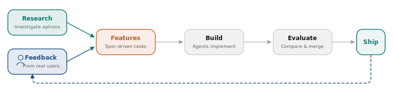
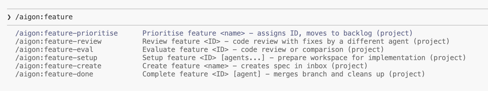
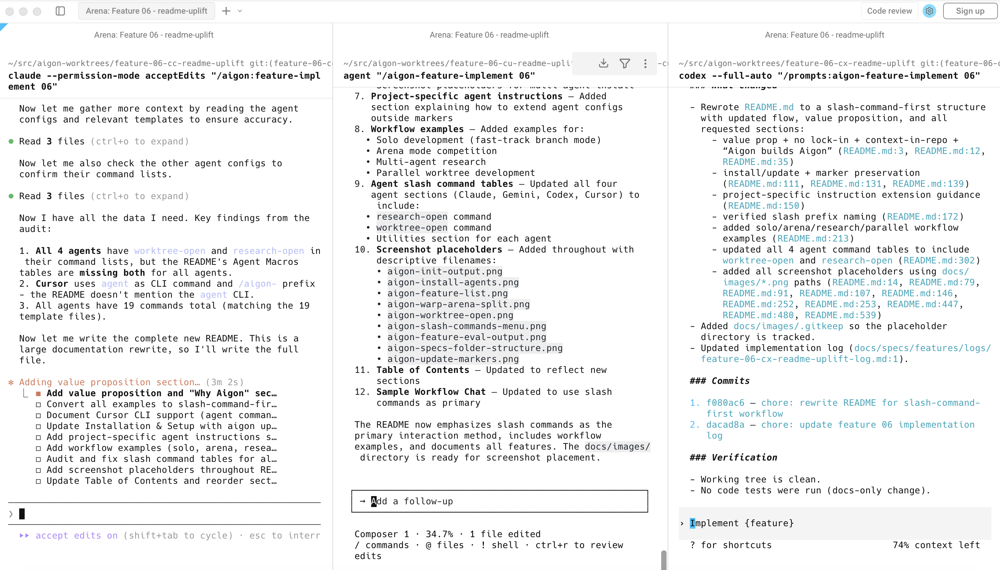
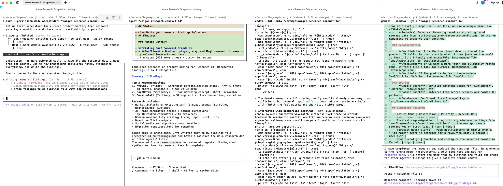
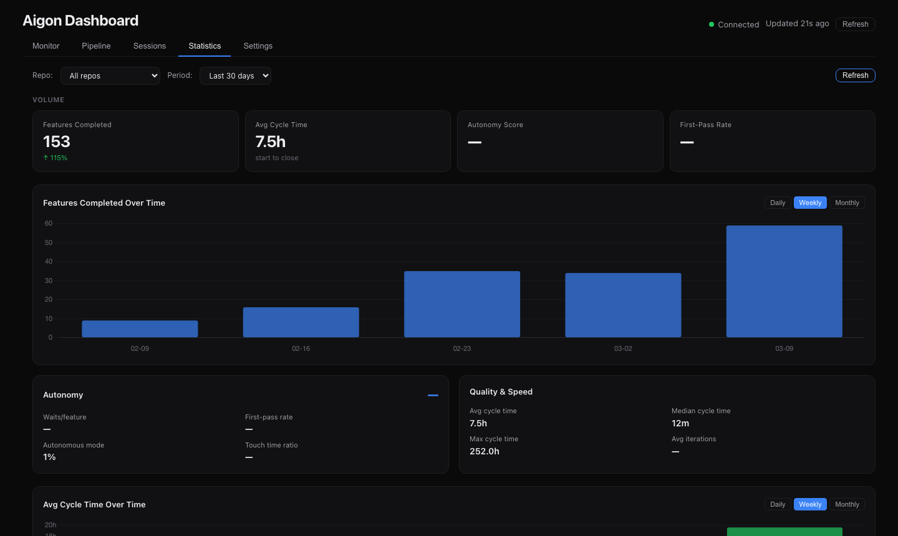

# Aigon


**Agent-first, CLI-capable, vendor-independent AI engineering workflows that keep your context in your repo.**

Aigon gives you a consistent spec workflow across Claude, Gemini, Codex, and Cursor without locking your team to one IDE or one model provider.

- **CLI based:** plain files + git + terminal commands
- **Vendor independent:** works across multiple agent ecosystems
- **Slash-command native:** use agent commands day to day, keep CLI as universal fallback
- **No lock-in:** your specs, logs, research, and evaluations remain in your repository

Aigon itself is built with Aigon. Browse `docs/specs/` in this repo to see real feature specs, implementation logs, research topics, and evaluations used to build and maintain the project.

```
docs/specs/
├── research-topics/            # Internal investigations (inbound funnel)
│   ├── 01-inbox/
│   ├── 02-backlog/
│   ├── 03-in-progress/
│   ├── 04-done/
│   │   ├── research-01-subdomains-for-multi-agent-mode.md
│   │   └── research-03-simplify-command-parameters.md
│   ├── 05-paused/
│   └── logs/
├── features/                   # Implementation specs (delivery pipeline)
│   ├── 01-inbox/
│   │   ├── feature-base-port-config.md
│   │   ├── feature-create-plugin.md
│   │   └── ...
│   ├── 02-backlog/
│   ├── 03-in-progress/
│   ├── 04-in-evaluation/
│   ├── 05-done/
│   │   ├── feature-01-support-hooks.md
│   │   ├── feature-13-feedback-foundation.md
│   │   ├── feature-14-feedback-triage-workflow.md
│   │   └── ...
│   ├── 06-paused/
│   ├── evaluations/
│   │   └── feature-14-eval.md
│   └── logs/
│       ├── selected/
│       └── alternatives/
├── feedback/                    # User/customer input (closes the loop)
│   ├── 01-inbox/               # New feedback awaiting triage
│   ├── 02-triaged/             # Classified and validated
│   ├── 03-actionable/          # Ready to promote to research/features
│   ├── 04-done/                # Resolved and closed
│   ├── 05-wont-fix/            # Reviewed and intentionally not actioned
│   └── 06-duplicate/           # Duplicates linked to canonical items
└── templates/
    ├── research-template.md
    ├── feature-template.md
    └── feedback-template.md
```

`aigon board` visualizes your pipeline as a Kanban board:

```
╔═══════════════════════ Aigon Board ════════════════════════╗

FEATURES
┌────────────────────────────────┼────────────────────────────────┼────────────────────────────────┐
│ Inbox                          │ In Progress                    │ Done                           │
├────────────────────────────────┼────────────────────────────────┼────────────────────────────────┤
│ a) base-port-config            │ #07 backlog-visualisation *    │ #01 support-hooks              │
│ b) change-banner-in-bakeoff    │                                │ #02 unify-workflow             │
│ c) create-plugin               │                                │ #03 arena-research             │
│ d) parallel-features           │                                │ #04 add-sample-chat-for-workfl │
│ e) refactor-aigon-sub-commands │                                │ #05 command-metadata-improveme │
│ f) research-open-arena         │                                │ #06 readme-uplift              │
├────────────────────────────────┼────────────────────────────────┼────────────────────────────────┤
│ (6)                            │ (1)                            │ (6)                            │
└────────────────────────────────┼────────────────────────────────┼────────────────────────────────┘
```

`*` = current branch, `[F]` = Fleet mode, `[AP]` = Autopilot mode, `[S]` = Swarm mode

---

📘 **New to Aigon?** This README covers the essentials. For detailed workflows, hooks, and advanced configuration, see the [Complete Guide](GUIDE.md)

---

## Table of Contents

1. [Why Aigon](#why-aigon)
2. [Core Philosophy](#core-philosophy)
3. [The Specs Architecture](#the-specs-architecture)
4. [Quick Start](#quick-start)
5. [Installation, Agents, and Updates](#installation-agents-and-updates)
6. [Project-Specific Agent Instructions](#project-specific-agent-instructions)
7. [Slash Command Prefixes](#slash-command-prefixes)
8. [Invocation Contexts (CLI vs In-Agent)](#invocation-contexts-cli-vs-in-agent)
9. [Workflow Overview](#workflow-overview)
10. [Workflow Examples](#workflow-examples)
11. [Hooks](#hooks)
12. [Local Dev Proxy](#local-dev-proxy)
13. [Multi-Agent Evaluation](#multi-agent-evaluation)
14. [CLI Reference](GUIDE.md#cli-reference) (in Complete Guide)

---

## Why Aigon

Aigon is for teams that want AI acceleration without handing their project memory to a third-party platform.

### Context stays with your code

Everything is stored in your repo:

- **feedback items** (`docs/specs/feedback/`) — raw user/customer input with attribution
- **research topics** and findings (`docs/specs/research-topics/`) — internal investigations
- **feature specs** (`docs/specs/features/`) — implementation plans with acceptance criteria
- **implementation logs** (`docs/specs/features/logs/`) — what was built and why
- **evaluation reports** (`docs/specs/features/04-in-evaluation/`) — code reviews and comparisons

That history becomes reusable context for future AI sessions, code reviews, and onboarding. In contrast, tool-hosted chat history is typically siloed per vendor account and hard to reuse across tools.

### Complete product lifecycle: Research → Ideas → Features → Feedback (loop)



Aigon handles the **full lifecycle of changes**, creating a closed loop from exploration to shipped code and back:

1. **Research** (internal exploration) — Investigate technical possibilities, evaluate options, and synthesize recommendations before committing to implementation.

2. **Ideas** (feature specs) — Define what to build with acceptance criteria, informed by research findings.

3. **Features** (implementation + delivery) — Build, evaluate, and ship the code.

4. **Feedback** (external signal) — Capture user reports, support tickets, and customer requests from shipped features. Triage with AI assistance to classify, deduplicate, and route actionable items back into research or new features.

**The loop closes:** Feedback from end users spawns new research topics or features, creating an auditable trail:
- "This feature addresses feedback #42 and was informed by research #07"
- "Feedback #42 about the dark mode shipped in v2.1 resulted in feature #108"
- "Research #07 was triggered by feedback #35, #36, and #41"

This answers both "why did we build this?" (forward traceability) and "what happened to my request?" (backward traceability), keeping product decisions transparent and evidence-based.

### Built for real multi-agent workflows

Aigon uses four modes across two axes:

```
                    One Agent          Multi-Agent
                 ┌──────────────┬──────────────────┐
  Hands-on       │    Drive     │      Fleet       │
                 ├──────────────┼──────────────────┤
  Hands-off      │  Autopilot   │      Swarm       │
                 └──────────────┴──────────────────┘
                         Autonomous
```

- **Drive mode**: one agent, hands-on
- **Fleet mode**: multiple agents, hands-on competition
- **Autopilot mode**: one agent, hands-off autonomous loop
- **Swarm mode**: multiple agents, hands-off autonomous loop
- **Fleet research**: parallel findings plus synthesis (`research-setup` + `research-open` + `research-synthesize`)

---

## Core Philosophy

Aigon implements spec-driven AI development using Git and the filesystem as the foundation:

- **State-as-Folders:** Task status is defined by *where it lives* (`inbox`, `backlog`, `in-progress`), not by database records
- **Decoupled Lifecycles:** Research explores *what* to build; Features define *how* to build it
- **Traceable History:** All agent conversations and implementation attempts are preserved as Markdown files in your repository

This approach keeps your workflow transparent, portable, and fully version-controlled.

---

## The Specs Architecture

All workflow state lives in `./docs/specs`, organized into three pillars:

**Inbound funnels (what to build):**
- `feedback/` — Raw user/customer input requiring triage and routing
- `research-topics/` — Internal investigations exploring technical possibilities

**Delivery pipeline (how to build it):**
- `features/` — Implementation specs with acceptance criteria

**Lifecycle folders (Kanban):**
Each pillar uses folder-based status:
- `01-inbox/` — New, unprioritized items
- `02-backlog/` — Prioritized, ready to start (research/features only)
- `02-triaged/` — Classified and validated (feedback only)
- `03-in-progress/` — Currently being worked on
- `03-actionable/` — Ready to promote to research/features (feedback only)
- `04-in-evaluation/` — Completed, being reviewed
- `05-done/` — Finished and merged
- `06-paused/` — Temporarily on hold

**Documentation:**
- `logs/` — Implementation logs (selected winners + alternatives)
- `evaluations/` — Fleet comparison reports

**Naming conventions:**
- Drafts: `feature-description.md` (in inbox)
- Prioritized: `feature-55-description.md` (global ID assigned)
- Agent-specific: `feature-55-cc-description-log.md` (Fleet mode)

## Code Module Map

The CLI is split into focused domain modules under `lib/`:

| Module | Responsibility |
|--------|---------------|
| `aigon-cli.js` | Entry point — argument parsing, command dispatch |
| `lib/proxy.js` | Port allocation, registry, dev-server registration, proxy integration |
| `lib/aigon-proxy.js` | Standalone reverse proxy daemon — routes by Host header, WebSocket support |
| `lib/dashboard-server.js` | HTTP server, polling, WebSocket relay, notifications, action dispatch |
| `lib/worktree.js` | Worktree creation, permissions, trust, tmux sessions, terminal launching |
| `lib/config.js` | Global/project config, profiles, agent CLI config, editor detection |
| `lib/templates.js` | Template reading, processing, scaffolding, command registry |
| `lib/utils.js` | Shared utilities: hooks, YAML parsers, spec CRUD, analytics, version |
| `lib/git.js` | Git operations — single source of truth for all git calls |
| `lib/state-machine.js` | Action modes and valid state transitions |
| `lib/commands/shared.js` | Thin factory (~150 lines) — builds `ctx` and composes all domain command files |
| `lib/commands/feature.js` | All `feature-*` command handlers and `sessions-close` |
| `lib/commands/research.js` | All `research-*` command handlers |
| `lib/commands/feedback.js` | `feedback-create`, `feedback-list`, `feedback-triage` |
| `lib/commands/infra.js` | `conductor`, `dashboard`, `terminal-focus`, `board`, `proxy-setup`, `dev-server`, `config`, `hooks`, `profile` |
| `lib/commands/setup.js` | `init`, `install-agent`, `check-version`, `update`, `doctor` |
| `lib/commands/misc.js` | `agent-status`, `status`, `deploy`, `next`, `help` |

---

## Quick Start

### 1. Install Aigon CLI

```bash
git clone https://github.com/yourname/aigon.git
cd aigon
npm install
npm link
```

### 2. Initialize your project

```bash
cd /path/to/your/project
aigon init
```

Output:
```
aigon init
ACTION: Initializing Aigon in ./docs/specs ...
✅ ./docs/specs directory structure created.
aigon install-agent cc cx gg cu
✅ Created: docs/development_workflow.md
✅ Created: AGENTS.md

📦 Installing Claude (cc)...
   ✅ Created: docs/agents/claude.md
   ✅ Commands: 56 created
   ✅ Created: .claude/skills/aigon/SKILL.md
   ✅ Added permissions to .claude/settings.json
   🛡️  Added deny rules to .claude/settings.json
   🔄 Added SessionStart hook to .claude/settings.json

📦 Installing Codex (cx)...
   ✅ Created: docs/agents/codex.md
   ✅ Installed global prompts: ~/.codex/prompts
   ⚠️  Note: Codex prompts are global (shared across all projects)
   ✅ Created: .codex/prompt.md
   ✅ Created: .codex/config.toml

📦 Installing Gemini (gg)...
   ✅ Created: docs/agents/gemini.md
   ✅ Commands: 56 created
   ✅ Created .gemini/policies/aigon.toml (Policy Engine)
   🔄 Added SessionStart hook to .gemini/settings.json

📦 Installing Cursor (cu)...
   ✅ Created: docs/agents/cursor.md
   ✅ Commands: 56 created
   ✅ Added permissions to .cursor/cli.json
   🔄 Added SessionStart hook to .cursor/hooks.json
   ✅ Created: .cursor/rules/aigon.mdc

🎉 Installed Aigon for: Claude, Codex, Gemini, Cursor
```

### 3. Install agent integrations

```bash
# Install one agent
aigon install-agent cc

# Install multiple agents
aigon install-agent cc gg cx cu
```

### 4. Use slash commands in your agent

Primary day-to-day usage is via slash commands.

- Claude / Gemini: `/aigon:feature-create dark-mode`
- Codex: `/prompts:aigon-feature-create dark-mode`
- Cursor: `/aigon-feature-create dark-mode`



---

## Installation, Agents, and Updates

### Supported agents

| Code | Agent | Slash prefix | CLI command | Notes |
|------|-------|--------------|-------------|-------|
| `cc` | Claude Code | `/aigon:` | `claude` | Namespaced slash commands in `.claude/commands/aigon/` |
| `gg` | Gemini CLI | `/aigon:` | `gemini` | Commands in `.gemini/commands/aigon/` |
| `cx` | Codex | `/prompts:aigon-` | `codex` | Global prompts in `~/.codex/prompts/` |
| `cu` | Cursor | `/aigon-` | `agent` | Supports Cursor Agent and Composer command flows |

### What `install-agent` writes (and what it doesn't)

`aigon install-agent` writes **only aigon-owned files**. It never touches user-owned root files like `CLAUDE.md`.

**Files created/updated per agent:**

| Agent | Slash commands | Settings/permissions | Context delivery | Hooks |
|-------|---------------|---------------------|-----------------|-------|
| **cc** (Claude) | `.claude/commands/aigon/*.md` | `.claude/settings.json` (permissions, hooks) | `.claude/skills/aigon/SKILL.md` + SessionStart hook | `aigon check-version`, `aigon project-context` |
| **gg** (Gemini) | `.gemini/commands/aigon/*.toml` | `.gemini/settings.json` (hooks), `.gemini/policies/aigon.toml` | SessionStart hook | `aigon check-version`, `aigon project-context` |
| **cx** (Codex) | `~/.codex/prompts/aigon-*.md` (global) | `.codex/config.toml` | `.codex/prompt.md` | — |
| **cu** (Cursor) | `.cursor/commands/aigon-*.md` | `.cursor/cli.json`, `.cursor/hooks.json` | `.cursor/rules/aigon.mdc` | `aigon check-version` |

**Shared files (all agents):**

| File | Ownership | Created | Updated on re-install |
|------|-----------|---------|----------------------|
| `AGENTS.md` | User-owned | Scaffolded on first install only | Never — your file, your content |
| `docs/agents/{agent}.md` | Aigon-owned (marker blocks) | Yes | Yes (content between markers only) |
| `docs/development_workflow.md` | Aigon-owned | Yes | Yes (full overwrite) |

**What aigon never writes to:**
- `CLAUDE.md` — entirely user-owned
- Any file outside the paths listed above

### How context reaches each agent

Instead of injecting marker blocks into user-owned files, aigon delivers context through each agent's native extension mechanism:

- **Claude Code / Gemini CLI**: A `SessionStart` hook runs `aigon project-context`, which prints doc pointers to stdout. The agent ingests this as conversation context on every session start.
- **Cursor**: A native rules file at `.cursor/rules/aigon.mdc` with `alwaysApply: true` provides the same context.
- **Codex**: A native prompt file at `.codex/prompt.md` provides the same context.

### Updating

```bash
aigon update
```

Re-runs `install-agent` for all detected agents. Updates command templates, hooks, and aigon-owned doc files. Never touches `CLAUDE.md` or `AGENTS.md`.

**Auto-update**: The `aigon check-version` SessionStart hook detects version mismatches and runs `aigon update` automatically on the next agent session start.

### Configuration and Security

**Default behavior:** Aigon uses permissive "yolo mode" flags by default that auto-approve agent commands:
- **cc** (Claude): `--permission-mode acceptEdits` (auto-edits, prompts for risky Bash)
- **cu** (Cursor): `--force` (auto-approves commands)
- **gg** (Gemini): `--yolo` (auto-approves all)
- **cx** (Codex): `--full-auto` (workspace-write, smart approval)

**To use stricter permissions** (e.g., for corporate environments):

```bash
aigon config init --global                              # Create global config
aigon config set --global agents.cc.implementFlag ""    # Remove auto-approval for Claude
```

Set `implementFlag` to `""` (empty string) for any agent to require manual approval prompts.

**Terminal and tmux config:**

```bash
aigon config set --global terminal tmux          # Use tmux for persistent sessions
aigon config set --global tmuxApp iterm2         # Use iTerm2 with native tmux -CC integration
```

**Project-level config** defaults to project scope:

```bash
aigon config init                       # Create project config (auto-detects profile)
aigon config set profile web            # Set project profile
aigon config get terminal               # Show value + where it comes from
aigon config show                       # Show merged effective config
aigon config models                     # Show resolved task models + source for each agent
```

`aigon config models` resolves task-level model overrides with this precedence:
`AIGON_<AGENT>_<TASK>_MODEL` env var > project config > global config (`~/.aigon/config.json`) > template default.

See the [Complete Guide](GUIDE.md#configuration) for all config commands and options.

---

## Project-Specific Agent Instructions

Add shared project rules directly in `AGENTS.md` and/or `CLAUDE.md`. These are your files — aigon scaffolds `AGENTS.md` on first install but never overwrites it afterward.

- **`AGENTS.md`**: Shared instructions read by Gemini, Codex, and Cursor (agents that support `supportsAgentsMd`)
- **`CLAUDE.md`**: Claude Code's native project instructions file — Claude reads this automatically
- **`docs/agents/{id}.md`**: Agent-specific operational notes (aigon-managed, marker blocks updated on install)

Aigon delivers its own context (doc pointers to workflow files) via SessionStart hooks and native rules files — it does not inject content into your root instruction files.

---

## Slash Command Prefixes

Aigon command naming by agent:

- Claude / Gemini: `/aigon:<command>`
- Cursor: `/aigon-<command>`
- Codex: `/prompts:aigon-<command>`

Examples for the same action:

- Claude: `/aigon:feature-do 42`
- Gemini: `/aigon:feature-do 42`
- Cursor: `/aigon-feature-do 42`
- Codex: `/prompts:aigon-feature-do 42`

---

## Invocation Contexts (CLI vs In-Agent)

Aigon has two command surfaces:

- **CLI context**: run `aigon ...` from a shell
- **In-agent context**: run slash commands inside an active agent session

Think of this as a second axis in addition to mode (Drive/Fleet/Autopilot/Swarm).

### Default way to work

1. **Start in an agent session** when shaping specs (create/prioritise/research) so you can iterate in conversation.
2. **Stay in-agent** for implementation/review/research execution.
3. **Drop to CLI when needed** for orchestration, automation, and terminal-first workflows.

### Recommended surface by task

| Task Type | Preferred Surface | Why |
|---|---|---|
| Spec authoring and refinement (`feature-create`, `feature-prioritise`, `research-create`, `research-prioritise`) | In-agent slash commands | Best for iterative back-and-forth on definitions and scope |
| Execution with an active agent (`feature-do`, `feature-review`, `research-do`, `research-synthesize`) | In-agent slash commands | Keeps context in the live session and avoids nested launches |
| Orchestration and terminal ops (`init`, `install-agent`, `update`, `feature-setup`, `feature-open`, `feature-close`, `feature-cleanup`) | CLI | Repo/worktree coordination, machine-level operations, scripting |
| Infra/config (`config`, `profile`, `proxy`, `dev-server`, `dashboard`) | CLI | Machine/project configuration and background services |

### Can I stay in one surface?

- **Agent-first is recommended** for creating/prioritising features and research when you want conversational iteration.
- **CLI-only is supported** and useful for automation or terminal-first habits.
- **Hybrid is common**: define in-agent, then orchestrate from CLI.

For deeper details and mode-specific nuances, see [GUIDE.md](GUIDE.md#command-surfaces-cli-vs-in-agent).

---

## Workflow Overview

Aigon organises work into three lifecycles:

| Lifecycle | Purpose | Commands |
|-----------|---------|----------|
| **Features** | Build and ship code | `feature-create` → `feature-prioritise` → `feature-setup` → `feature-do` → `feature-eval` → `feature-close` |
| **Research** | Investigate before building | `research-create` → `research-prioritise` → `research-setup` → `research-do` → `research-synthesize` → `research-close` |
| **Feedback** | Capture and triage user input | `feedback-create` → `feedback-list` → `feedback-triage` |

Each lifecycle can run in any of four modes:

| | **Hands-on** (you guide) | **Hands-off** (agent loops autonomously) |
|---|---|---|
| **Single agent** | **Drive** — you and one agent, step by step | **Autopilot** — agent retries until tests pass |
| **Multiple agents** | **Fleet** — agents compete, you pick the winner | **Swarm** — agents compete autonomously, you evaluate results |

The examples below show each combination with realistic commands.

---

## Workflow Examples

### Feature: Drive Mode (single agent, hands-on)

> You want to add JWT authentication. One agent, guided by you.

```text
/aigon:feature-create jwt-auth
```

The agent helps you write a spec, then:

```text
/aigon:feature-prioritise jwt-auth          # Assigns ID (e.g., #07)
/aigon:feature-setup 07                     # Creates branch, moves spec to in-progress
/aigon:feature-do 07                 # Agent reads spec and starts building
```

The agent works through the spec — creating middleware, adding token validation, writing tests. You review as it goes. When done:

```text
/aigon:feature-eval 07                      # Code review checklist
/aigon:feature-close 07                      # Merge to main
```

**Fast-track shortcut:** If you want to skip the ceremony, `feature-now` goes from idea to implementation in one step:

```text
/aigon:feature-now dark-mode
```

### Feature: Fleet Mode (multiple agents, hands-on)

> Same JWT auth feature, but three agents compete. You pick the best implementation.

```text
/aigon:feature-setup 07 cc gg cx           # Creates 3 worktrees, 3 branches
/aigon:feature-open 07 --all              # Opens all agents side-by-side
```



In each agent's terminal, run:

```text
/aigon:feature-do 07
```

Each agent reads the same spec and builds its own implementation independently. When all agents have submitted, evaluate:

```text
/aigon:feature-eval 07                     # Generates comparison scorecard
```

`feature-eval` checks each agent's status first — if someone hasn't submitted, you'll see:

```text
⚠️  1 agent(s) not yet submitted:
   cx (Codex) — status: implementing
     → aigon feature-open 07 cx
```

After evaluating, merge the winner and optionally adopt improvements from the losers:

```bash
aigon feature-close 07 cc                   # Merge Claude's implementation
aigon feature-close 07 cc --adopt all       # Merge + review diffs from gg and cx
aigon feature-cleanup 07                   # Remove losing worktrees
```

### Feature: Autopilot Mode (single agent, hands-off)

> You want the agent to keep iterating until tests pass, without hand-holding.

```text
/aigon:feature-setup 07 cc
/aigon:feature-do 07 --autonomous
```

The agent enters an autonomous loop:

```text
✈️  Autopilot mode
Agent: cc · Iterations: 1..4

🚀 Iteration 1/4
   Implementing...
   🧪 Validation: npm test ❌ (3 failures)

🚀 Iteration 2/4
   Fixing test failures...
   🧪 Validation: npm test ✅

✅ All checks passed · Ready for your review
```

Review the result and finish:

```text
/aigon:feature-eval 07
/aigon:feature-close 07
```

See [autonomous-mode.md](docs/autonomous-mode.md) for configuration options (`--max-iterations`, validation commands, progress tracking).

### Feature: Swarm Mode (multiple agents, hands-off)

> Three agents compete autonomously. Each retries until passing, then you evaluate the converged results.

```bash
aigon feature-setup 07 cc gg cx
aigon feature-open 07 --all
```

In each agent's terminal:

```text
/aigon:feature-do 07 --autonomous --auto-submit
```

```text
🐝 Swarm mode
cc: ✅ pass on iteration 1 · submitted
gg: ❌ iteration 1 · ✅ pass on iteration 2 · submitted
cx: ❌ iteration 1 · ✅ pass on iteration 2 · submitted
```

Once all agents submit:

```text
/aigon:feature-eval 07                     # Compare 3 passing implementations
aigon feature-close 07 cc                   # Merge the winner
aigon feature-cleanup 07                   # Clean up the rest
```

### Research: Drive Mode (single agent)

> You want one agent to investigate auth strategies for a mobile app.

```text
/aigon:research-create auth-strategy-mobile
/aigon:research-prioritise auth-strategy-mobile   # Assigns ID (e.g., #03)
/aigon:research-do 03
```

The agent investigates the topic, writes findings to `docs/specs/research-topics/logs/`, and answers the questions defined in the topic doc.

```text
/aigon:research-close 03
```

### Research: Fleet Mode (multiple agents)

> Three agents independently research the same topic, then you synthesize their perspectives.

```text
/aigon:research-setup 03 cc gg cx
/aigon:research-open 03                    # Opens all agents side-by-side
```



In each agent pane:

```text
/aigon:research-do 03
```

Each agent writes its findings independently. Then synthesize:

```text
/aigon:research-synthesize 03              # Compare findings, extract features
/aigon:research-close 03
```

### Feedback Lifecycle

> A user reports "search is slow on large datasets". Capture it, triage it, act on it.

```text
/aigon:feedback-create "Search is slow on large datasets"
/aigon:feedback-list --inbox               # See all untriaged feedback
/aigon:feedback-triage 5                   # AI-assisted severity/type/tag classification
```

The triage recommends severity, type (bug/feature/improvement), and tags. Apply the recommendation:

```bash
aigon feedback-triage 5 --apply --yes      # Accept AI recommendations
```

### Parallel Drive (multiple features, one agent)

> You have three independent features and want to work on all of them with Claude.

```bash
aigon feature-setup 100 cc
aigon feature-setup 101 cc
aigon feature-setup 102 cc
aigon feature-open 100 101 102 --agent=cc
```

Each feature gets its own worktree and branch. Switch between them freely.

---

## Terminal Setup (tmux + iTerm2)

Aigon supports persistent terminal sessions via **tmux**. Agent sessions survive terminal closes — detach, close your laptop, and reattach later to find the agent exactly where you left it.

### Prerequisites

```bash
brew install tmux                          # Required
brew install --cask iterm2                 # Optional but recommended
```

### Configuration

```bash
aigon config set --global terminal tmux    # Use tmux for all sessions
aigon config set --global tmuxApp iterm2   # Use iTerm2 with native tmux -CC integration
```

| `tmuxApp` value | Behaviour |
|-----------------|-----------|
| `terminal` (default) | Opens Terminal.app, runs `tmux attach` inside it |
| `iterm2` | Opens iTerm2 with `tmux -CC` — tmux windows become native iTerm2 tabs with scrollback, Cmd+F search, and trackpad scrolling |

### Session Lifecycle

```bash
aigon feature-setup 07 cc gg cx            # Creates tmux sessions: aigon-f7-cc, aigon-f7-gg, aigon-f7-cx
aigon feature-open 07 cc                  # Attaches to aigon-f7-cc (or creates if missing)
aigon feature-open 07 --all               # Opens all agents in separate windows

tmux ls                                    # List all Aigon sessions
# aigon-f7-cc: 1 windows (created ...)
# aigon-f7-gg: 1 windows (created ...)

aigon sessions-close 07                    # Kill all tmux sessions for feature 07
```

Detach from any session with `Ctrl-b d`. Reattach manually with `tmux attach -t aigon-f7-cc`.

### Supported Terminal Backends

| Backend | Config value | Agent auto-launch | Persistent sessions | Split panes |
|---------|-------------|-------------------|--------------------|-|
| **Warp** | `warp` | Yes | No | Yes (Fleet `--all`) |
| **tmux** | `tmux` | Yes | Yes (survives terminal close) | No (separate windows) |
| **VS Code** | `code` | No (manual) | No | No |
| **Cursor** | `cursor` | No (manual) | No | No |
| **Terminal.app** | `terminal` | Yes | No | No |

---

## Visualizing Work — Aigon Dashboard

### Dashboard in Action

A Fleet run on the BrewBoard seed project — Codex (cx) and Gemini (gg) compete to implement dark mode, then Claude Code (cc) evaluates and the winner is merged:

**1. Fleet started — Codex and Gemini implementing in parallel**


**2. Both agents submitted — Claude Code evaluating the implementations**


**3. Evaluation complete — winner selected and merged**


---

Once you start using aigon on multiple repositories with multiple features in parallel, you need a dashboard to work out what's happening where and to be able to intercept and take over as required.

**Aigon Dashboard** is a foreground HTTP server that watches all your registered repos and exposes a unified HTTP API. Every view — the web dashboard, VS Code sidebar, macOS menubar icon, and CLI status — consumes that one API rather than reading log files independently.

Aigon provides four ways to see what's happening across your projects: a **web dashboard**, a **VS Code sidebar**, a **macOS menubar icon**, and **macOS notifications** — all powered by the dashboard server.

### VS Code Sidebar (Aigon Dashboard)

An Aigon section in the Explorer sidebar shows live feature and agent status across all registered repos — no terminal needed.

**One-time setup:**

```bash
# 1. Register your repos (repeat for each project)
aigon dashboard add                    # adds cwd
aigon dashboard add ~/src/my-web-app  # adds another repo

# 2. Install the VS Code extension
aigon dashboard vscode-install

# 3. Reload VS Code — the Aigon panel appears in the Explorer sidebar
```

The sidebar opens with a **Needs Attention** section at the top — like Gmail's "important and unread" — followed by the full repo status below:

<!-- TODO: Replace with actual screenshot -->
<!--  -->

```
▼ AIGON
  ▼ 🔔 Needs Attention (3)
      🔔 #32  conductor-daemon     aigon · Claude needs input
      ✅ #12  dark-mode             my-web-app · Ready for eval
      🏆 #14  profile-redesign     my-web-app · Pick winner
  ▷ 📁 aigon
  ▷ 📁 my-web-app
```

Click any attention item to copy its slash command. Expand a repo for the full feature/agent breakdown:

```
  ▼ 📁 aigon
    ▼ 🔔 #32  conductor-daemon
        🔔 cc  ●  waiting   01:33    ← click to copy /afd 32
    ▼ ⟳  #33  conductor-vscode
        ⟳  cx  ○  implementing
        ✓  gg  ✓  submitted
```

- **🔔 Needs Attention** — waiting agents, features ready for eval, winners to pick
- **⟳ ○ implementing** — agent is actively working
- **✅ ✓ submitted** — all agents submitted, ready for eval
- **🏆 pick winner** — evaluation complete, winner identified
- Refresh button (↻) and stage toggle (☰) in the panel title bar
- Updates automatically via file watching — no polling, no manual refresh

**Dashboard commands:**

```bash
aigon dashboard add [path]           # Register a repo (default: cwd)
aigon dashboard remove [path]        # Unregister a repo
aigon dashboard list                 # List registered repos
aigon dashboard start [--port N]     # Start the dashboard service (daemon + dashboard + API)
aigon dashboard stop                 # Stop the dashboard service
aigon dashboard status               # Show service state, repos, and waiting agents
aigon dashboard open                 # Open the web dashboard in your browser
aigon dashboard install              # Auto-start on login (launchd)
aigon dashboard uninstall            # Remove auto-start
aigon dashboard vscode-install       # Install VS Code extension
aigon dashboard vscode-uninstall     # Remove VS Code extension
aigon dashboard menubar-install      # Install macOS menubar plugin
aigon dashboard menubar-uninstall    # Remove menubar plugin
```

**Dashboard HTTP API (local service):**

- `GET /api/status` — aggregated multi-repo status payload
- `GET /api/repos` — registered repo list
- `POST /api/attach` — open terminal and attach to an agent tmux session
- `POST /api/action` — run allowlisted workflow actions in a target repo

`POST /api/action` request body:

```json
{
  "repoPath": "/abs/path/to/repo",
  "action": "feature-eval",
  "args": ["55", "--agent=cx"]
}
```

### macOS Menubar (Aigon Dashboard)

A menubar icon that shows live agent status at a glance — click to expand a menu of all features and agents across repos, then click any agent to jump directly to its terminal. The menubar plugin calls the dashboard's HTTP API for its data.

**One-time setup:**

```bash
# 1. Install SwiftBar (or xbar)
brew install --cask swiftbar

# 2. Register your repos (if not already done)
aigon dashboard add

# 3. Install the menubar plugin
aigon dashboard menubar-install
```

The menubar shows a gear icon with an attention count: `⚙ 3 needs attention` or `⚙ 5 running` or `⚙ –` when idle. Click to expand:

<!-- TODO: Replace with actual screenshot -->
<!--  -->

```
⚙ 2 needs attention
───────────────────────────
🔔 NEEDS ATTENTION
  🔔 Claude needs input        ← click to open terminal
     ~/src/aigon · #32 conductor-daemon
  ⚡ Ready for eval
     ~/src/my-web-app · #12 dark-mode
───────────────────────────
~/src/aigon
  #32 conductor-daemon
    ● cc: waiting
    ○ gg: implementing
~/src/my-web-app
  #12 dark-mode [eval needed]
    ✓ solo: submitted
```

- **Needs Attention** section at the top surfaces what needs you right now
- **Click** an agent → opens/focuses its terminal (Warp, VS Code, or Terminal.app)
- **Option-click** (⌥) an agent → copies the slash command to clipboard
- Refreshes every 30 seconds automatically

You can also jump to any feature's terminal directly from the CLI:

```bash
aigon terminal-focus 39        # open terminal for feature #39
aigon terminal-focus 39 cc     # open terminal for specific agent
```

### Dashboard Statistics — Measuring Your Throughput

As an AI developer you are not just building software — you are running an optimisation loop. The Dashboard Statistics tab closes that loop by turning your spec and log history into quantitative insight: how many features are you shipping per week, how long does each one take, and where are the bottlenecks?



Open the Statistics tab at `aigon dashboard open` then click **Statistics**.

#### What the dashboard shows

**Volume** — Features completed over the selected period with a week-over-week trend. Switch between Daily, Weekly, and Monthly granularity; scroll back through history with the ← → navigation. The 30-day trend card shows percentage change so you can tell at a glance whether your pace is accelerating.

**Cycle Time** — Average hours from `feature-setup` to `feature-close` across the same window, plotted over time. Knowing your typical cycle time lets you spot when a class of features is taking 3× longer than normal and investigate before it becomes a pattern.

**Features Completed Over Time** — A bar chart showing throughput by time bucket (daily/weekly/monthly) across all repos or filtered to one project. Scroll backwards to compare this month against three months ago.

**Avg Cycle Time Over Time** — The same time-bucketed view but for duration. Pairs with the volume chart to distinguish "we shipped more because we went faster" from "we shipped more because we added capacity".

**Agent Leaderboard** — Per-agent breakdown of features completed, eval wins, fleet win %, and average cycle time. Tells you which agent tends to produce the fastest, highest-quality implementations for a given class of problem.

**Autonomy Score** _(coming soon)_ — The proportion of commits made outside active working hours, used as a proxy for how much of your pipeline is running unattended. As autonomous workflows mature and the signal becomes reliable, this will become the headline metric: the dashboard will show you not just how fast you shipped, but how much of that speed required your attention at all.

#### Why this matters

When you run multiple AI agents in parallel, output rises fast — but so does noise. Without measurement you cannot distinguish a genuinely fast week from a week where most features were trivial. The Statistics tab gives you:

- **A baseline** — what is your normal weekly feature velocity across repos?
- **A signal** — is cycle time trending up because features are getting harder, or because agent quality has dropped?
- **A comparison axis** — which agent is consistently faster for implementation-only tasks vs. research-heavy ones?

The goal is not to maximise raw feature count. It is to increase meaningful throughput — features that pass eval on first submission — while reducing the cycle time of each one. The dashboard makes that optimisation loop visible.

#### Backfilling historical data

If you adopted Aigon mid-project your early logs may lack `startedAt` and `completedAt` timestamps. Run the backfill command to reconstruct them from git history:

```bash
aigon feature-backfill-timestamps --dry-run   # preview changes
aigon feature-backfill-timestamps             # apply
```

After backfilling, click **Refresh** in the Statistics tab to reload analytics.

### Kanban Board View (terminal)

Aigon also provides two terminal views: **Kanban board** (visual overview) and **detailed list** (with work mode indicators and contextual next-action hints).

```bash
aigon board --all    # Show all including done items
```

Output:
```
╔═══════════════════════ Aigon Board ════════════════════════╗

FEATURES
┌────────────────────────────────┼────────────────────────────────┼────────────────────────────────┐
│ Inbox                          │ In Progress                    │ Done                           │
├────────────────────────────────┼────────────────────────────────┼────────────────────────────────┤
│ a) base-port-config            │ #07 backlog-visualisation *    │ #01 support-hooks              │
│ b) change-banner-in-bakeoff    │                                │ #02 unify-workflow             │
│ c) create-plugin               │                                │ #03 arena-research             │
│ d) parallel-features           │                                │ #04 add-sample-chat-for-workfl │
│ e) refactor-aigon-sub-commands │                                │ #05 command-metadata-improveme │
│ f) research-open-arena         │                                │ #06 readme-uplift              │
│ g) subdomain-configuration-for │                                │ change-worktree-location       │
│ h) update-docs-prompt-to-done  │                                │ install-agent-cleanup-old-comm │
│                                │                                │ open-worktrees-in-side-by-side │
│                                │                                │ feature-open-terminal         │
├────────────────────────────────┼────────────────────────────────┼────────────────────────────────┤
│ (8)                            │ (1)                            │ (10)                           │
└────────────────────────────────┼────────────────────────────────┼────────────────────────────────┘

RESEARCH
┌────────────────────────────────┼────────────────────────────────┐
│ Inbox                          │ Done                           │
├────────────────────────────────┼────────────────────────────────┤
│ i) plugin-distribution         │ #01 subdomains-for-multi-agent │
│                                │ #02 claude-agent-teams-integra │
│                                │ #03 simplify-command-parameter │
├────────────────────────────────┼────────────────────────────────┤
│ (1)                            │ (3)                            │
└────────────────────────────────┼────────────────────────────────┘
```

**Current Status:**
- **8 features** in inbox (unprioritized) with letter shortcuts (a-h)
- **1 feature in progress**: #07 backlog-visualisation (current branch ★)
- **10 features** completed
- **1 research topic** in inbox with letter shortcut (i)
- **3 research topics** completed

**Quick Actions:**

Pick an inbox item to prioritize:
```bash
/aigon:feature-prioritise a    # base-port-config
/aigon:feature-prioritise c    # create-plugin
/aigon:feature-prioritise d    # parallel-features
/aigon:research-prioritise i   # plugin-distribution
```

Or fast-track a feature (matches inbox letter shortcuts too):
```bash
/aigon:feature-now c           # matches create-plugin in inbox → prioritise + setup + implement
/aigon:feature-now dark-mode   # no inbox match → creates new feature + implement
```

**Indicators in Kanban view:**
- `*` = current branch
- `[F]` = Fleet mode
- `[AP]` = Autopilot mode
- `[S]` = Swarm mode
- `a), b), c)...` = letter shortcuts for quick prioritization

### Detailed List View

```bash
aigon board --list
```

Output:
```
FEATURES

Inbox (4):
        base-port-config
        create-plugin
        parallel-features
        refactor-aigon-sub-commands

In Progress (1):
   #07  backlog-visualisation  Drive (branch) *

RESEARCH

Inbox (1):
        plugin-distribution
```

**Filtering options:**
```bash
aigon board --features          # Show only features
aigon board --research          # Show only research
aigon board --active            # Show only in-progress items
aigon board --list --active     # Detailed list of active items
aigon board --all               # Include done items
aigon board --no-actions        # Hide contextual next-action hints
```

---

## Hooks

Hooks let you run custom scripts before and after Aigon commands.

- Define hooks in `docs/aigon-hooks.md`
- Hook names follow `pre-<command>` and `post-<command>` headings
- Pre-hook failure aborts the command
- Post-hook failure warns but does not roll back completed command

Common use cases:

- database branch setup/teardown
- service orchestration
- project-specific automation steps

Run `aigon hooks list` to inspect discovered hooks.

---

## Local Dev Proxy

When running multiple agents on the same web app, managing port numbers is painful. Aigon's dev proxy replaces ports with meaningful subdomain URLs using a built-in Node.js proxy and `.localhost` domains.

**URL scheme:** `{agent}-{featureId}.{appId}.localhost`

| Scenario | URL |
|---|---|
| Claude on feature 119 of whenswell | `http://cc-119.whenswell.localhost` |
| Gemini on feature 119 of whenswell | `http://gg-119.whenswell.localhost` |
| Claude on feature 120 of whenswell | `http://cc-120.whenswell.localhost` |
| Main branch / general dev | `http://whenswell.localhost` |

The proxy also routes the **Aigon dashboard**:

| Scenario | URL |
|---|---|
| Main dashboard (operator console) | `http://aigon.localhost` |
| Worktree dashboard (cc, feature 119) | `http://cc-119.aigon.localhost` |
| Worktree dashboard (gg, feature 119) | `http://gg-119.aigon.localhost` |

### Prerequisites

`.localhost` domains resolve to `127.0.0.1` automatically per RFC 6761 — **no DNS configuration needed**. Just start the proxy:

```bash
# One-time setup: install as system daemon on port 80 (asks for sudo once)
aigon proxy install
```

Without the proxy running, everything falls back to `localhost:<port>` and works as before.

### Quick setup

```bash
# In your project — start dev server and get its URL
aigon dev-server start
#   ⏳ Starting dev server: npm run dev
#      Waiting for server on port 3847... ready!
#   🌐 Dev server running
#      URL:  http://cc-119.whenswell.localhost
#      Port: 3847  PID: 73524

# Manage servers
aigon dev-server logs      # View dev server output
aigon dev-server logs -f   # Follow logs in real time
aigon dev-server list      # Show all active servers
aigon dev-server stop      # Stop process and deregister
aigon dev-server gc        # Clean up dead entries
aigon dev-server url       # Print URL for scripting
```

The dashboard registers automatically when you start it:

```bash
aigon dashboard start          # Main dashboard → http://aigon.localhost
# From a worktree:
aigon dashboard start          # Worktree dashboard → http://cc-119.aigon.localhost
```

If the proxy isn't set up, everything falls back to `localhost:<port>` — existing workflows are unaffected.

Only **web** and **api** profiles use the dev proxy for project dev servers. The dashboard uses the proxy regardless of profile. iOS, Android, library, and generic profiles are not affected for dev server routing.

See the [Complete Guide](GUIDE.md#local-dev-proxy) for detailed setup instructions, per-project configuration, and troubleshooting.

---

## Multi-Agent Evaluation

After Fleet implementations are complete:

```bash
aigon feature-eval 55
```

Before starting, `feature-eval` checks each agent's submission status. If any agent hasn't submitted, you'll see a warning with the command to reconnect:

```text
⚠️  1 agent(s) not yet submitted:
   cx (Codex) — status: implementing
     → aigon feature-open 55 cx
```

Use `--force` to skip the check and evaluate anyway.

This generates a structured comparison template so you can score implementations against spec compliance, quality, maintainability, and performance.

**Meta example:** This very README was improved using Fleet mode! Three agents (Claude, Cursor, Codex) each created their own implementation, and the best approach was selected through evaluation.

### Real Fleet Evaluation: Feature 06 - README Uplift

**Mode:** Fleet (Multi-agent comparison)

**Implementations:**
- **cc** (Claude): Hybrid approach - README + GUIDE split
- **cu** (Cursor): Comprehensive single-file (1091 lines)
- **cx** (Codex): Ultra-concise single-file (530 lines)

**Evaluation Criteria:**

| Criteria | cc | cu | cx |
|----------|----|----|-----|
| Spec Compliance | 8/10 | 10/10 | 9/10 |
| Code Quality | 7/10 | 9/10 | 8/10 |
| Documentation | 3/10 | 10/10 | 7/10 |
| Completeness | 7/10 | 10/10 | 8/10 |
| Maintainability | 9/10 | 9/10 | 6/10 |
| **TOTAL** | **34/50** | **48/50** | **38/50** |

**Winner: cc (Claude) - Hybrid Approach** ⭐

After initial evaluation, a hybrid approach was developed combining Codex's concise structure with Cursor's comprehensive content:
- **README.md** (626 lines): Scannable quick reference
- **GUIDE.md** (465 lines): Detailed workflows and configuration
- **Best of both worlds**: Conciseness for first-time visitors + completeness for advanced users
- **Clear reader journey**: Quick start → detailed documentation

See the complete evaluation with detailed strengths/weaknesses analysis in [`docs/specs/features/evaluations/feature-06-eval.md`](docs/specs/features/evaluations/feature-06-eval.md).

After selecting a winner:

```bash
aigon feature-close 55 cx
aigon feature-cleanup 55 --push
```

To adopt valuable improvements from losing agents (extra tests, error handling, edge cases):

```bash
aigon feature-close 55 cx --adopt all        # Review diffs from all losers
aigon feature-close 55 cx --adopt gg cu      # Review diffs from specific agents
```

The `--adopt` flag prints diffs from each losing agent after merging the winner, so you can selectively apply their best contributions.

---

For the full CLI reference and agent slash command tables, see the [Complete Guide — CLI Reference](GUIDE.md#cli-reference).

---

## Comparing Aigon to Other Tools

Wondering how Aigon compares to Cursor IDE, Windsurf, or other integrated AI development tools?

See [COMPARISONS.md](COMPARISONS.md) for strategic analysis including:
- Philosophy and architecture differences
- Feature comparison tables
- Strengths and weaknesses
- Cost analysis
- When to choose which tool
- How to use Aigon + Cursor together

**Key insight:** Aigon and tools like Cursor can complement each other—use Aigon for vendor-independent workflow orchestration and include Cursor as one agent in Fleet mode.

---

📘 **For detailed workflows, hooks, project profiles, and advanced configuration, see the [Complete Guide](GUIDE.md)**
