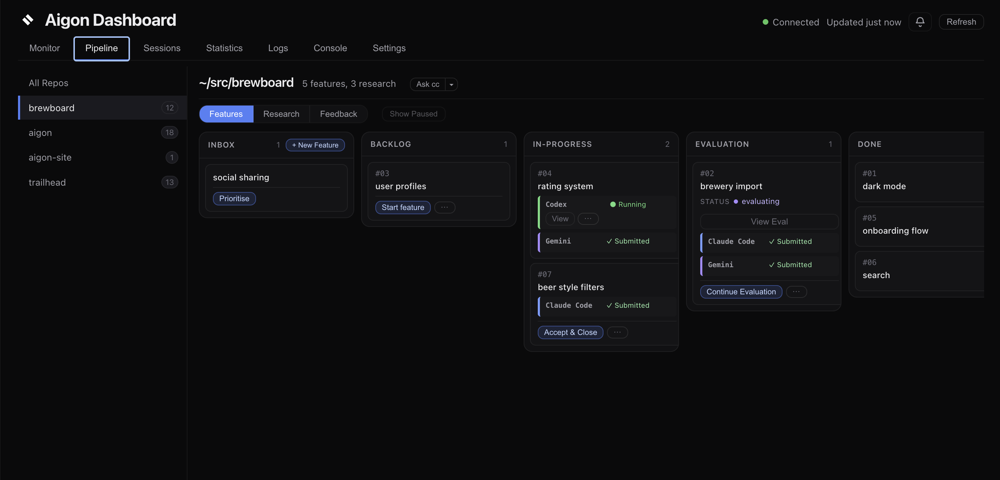

<p align="center">
  
</p>

<h1 align="center">Aigon</h1>

<p align="center">
  <strong>Spec-driven AI development and multi-agent orchestration.</strong>
  <br/>
  Run Claude, Gemini, Codex, and Cursor as a team on the same feature — then ship the best result.
</p>

<p align="center">
  <a href="https://github.com/jayvee/aigon/actions/workflows/test.yml"></a>
  <a href="LICENSE"></a>
  
  <a href="https://www.aigon.build"></a>
</p>

<p align="center">
  
</p>

> Aigon is an open source project by [Sen Labs](https://senlabs.ai). Follow [aigon.build](https://www.aigon.build) for updates.

---

## What is Aigon?

Aigon is an open-source, spec-driven orchestration system for AI coding agents — run them head-to-head on the same feature, then score their work so you can ship with confidence.

You work with Aigon from wherever you already are: **slash commands** inside your agent (Claude Code, Gemini CLI, Codex CLI, Cursor), a **web dashboard** on `localhost`, or direct **CLI commands** in your terminal. All three surfaces read and write the same Markdown specs in your repo — no SaaS account, no vendor lock-in, no proprietary state.

It works with the AI coding tools you already use:

- 🤖 **Claude Code** (`cc`)
- 💎 **Gemini CLI** (`gg`)
- 📟 **Codex CLI** (`cx`)
- 🎯 **Cursor** (`cu`)

Mix and match. Aigon doesn't care which model writes the code — it just manages the workflow around them.

## Why Aigon?

- **Spec-driven** — features, research, and feedback are tracked as Markdown files in your repo. Human-readable, git-versioned, diffable. No opaque SaaS database.
- **Multi-agent Fleet mode** — run two or three agents on the same spec in parallel, compare the results, merge the winner. The only tool that does this across model vendors.
- **Solo Drive mode** — single agent, single worktree, single branch. Get in, implement, get out.
- **Autonomous mode** (in development as part of Aigon Pro) — AutoConductor runs implement → review → close unattended.
- **Research workflow** — parallel research topics across multiple agents, then synthesize and promote findings into features.
- **Feedback triage** — capture user input, de-duplicate, promote the actionable bits into features.
- **Dashboard** — web kanban for features/research/feedback, telemetry charts, session monitoring, logs. Runs on `localhost`.
- **No lock-in** — plain Markdown files in git. If Aigon disappears tomorrow, your specs and history are still there.
- **Vendor independent** — we orchestrate, you choose the model.

## Quick start

**Prerequisites:** Node.js 18+, Git 2.20+, and tmux (for Fleet/worktree mode). See the [Getting Started guide](https://www.aigon.build/docs/getting-started) for platform-specific install instructions.

```bash
# Install aigon
git clone https://github.com/jayvee/aigon.git ~/src/aigon
cd ~/src/aigon && npm install && npm link

# Set up your project
cd /path/to/your/project
aigon init
aigon install-agent cc        # Install the Claude Code agent
aigon doctor                  # Verify environment
```

Create and implement your first feature — the fastest path is `/aigon:feature-now` from **inside Claude Code**:

```
/aigon:feature-now dark-mode
Add a dark mode toggle with system preference detection, persist
the choice in localStorage, and default to the system preference.
```

That one command creates the spec, assigns an ID, creates a feature branch, and starts implementing — all in your current repo. You stay in your agent the whole time.

Prefer the terminal? Run `feature-create` with a short description and draft the spec collaboratively with an agent:

```bash
aigon feature-create dark-mode --agent cc "dark mode toggle with system preference detection, persisted in localStorage"
```

Aigon writes a bare spec from your description, then launches Claude Code (`cc`) **interactively** in your terminal with the drafting context pre-loaded. You have a real conversation with the agent — it asks clarifying questions, proposes user stories and acceptance criteria, you push back and iterate, and when you're satisfied you exit the session. The drafted spec lands in `docs/specs/features/01-inbox/` for a final review — nothing is committed, no branch is created, no work starts yet. When you're happy with the draft, move it forward:

```bash
aigon feature-prioritise dark-mode           # Assigns an ID, moves to backlog
aigon feature-start dark-mode cc             # Single-agent Drive mode in a worktree
# or
aigon feature-start dark-mode cc cx          # Fleet mode — Claude and Codex race the implementation
aigon feature-eval dark-mode                 # Compare results, pick the winner
```

Or spin up the web dashboard (`aigon server start`) and click "New Feature" on the kanban board. Same specs, three surfaces — pick whichever fits the moment.

## Demo

<p align="center">
  
</p>

The [Aigon dashboard](https://www.aigon.build/docs/guides/dashboard) shows features across their full lifecycle — inbox → backlog → in-progress → in-evaluation → done — with live agent session status, commit activity, telemetry, and logs. Above: a Fleet-mode feature being evaluated across three agents.

## Documentation

Full documentation lives at **[aigon.build/docs](https://www.aigon.build/docs)**:

- 📘 [Getting Started](https://www.aigon.build/docs/getting-started) — install and run your first feature
- 🧭 [Core Concepts](https://www.aigon.build/docs/concepts) — workflows, execution modes, reliability
- 🛠 [Guides](https://www.aigon.build/docs/guides) — Drive, Fleet, Autopilot, Research, Dashboard, Telemetry
- 📚 [CLI Reference](https://www.aigon.build/docs/reference/commands) — every command documented
- 🔍 [Agents](https://www.aigon.build/docs/reference/agents) — Claude, Gemini, Codex, Cursor setup

## Aigon Pro (coming later)

Aigon Pro is a planned commercial tier that extends the free workflow with three things the open-source side intentionally doesn't do:

- **Autonomous orchestration** — AutoConductor runs implement → review → close unattended, so you can hand off a feature and come back to a merged PR
- **Insights** — deeper analytics over your whole feature history: agent quality trends, cost per delivered change, token efficiency over time, agent-vs-agent comparisons
- **AI-powered coaching** — recommendations based on your workflow patterns, so the system learns what "shipping well" looks like for your team

**Pro is in development and not yet available for purchase.**

The free tier — Drive mode, manual Fleet, the dashboard, interactive evaluation/review, telemetry, and basic reports — is complete and stays free and open source. See the [Pro page](https://www.aigon.build/pro) for a preview of what's coming.

## Community and support

- 💬 [GitHub Discussions](https://github.com/jayvee/aigon/discussions) — questions, workflows, design ideas
- 🐛 [Issues](https://github.com/jayvee/aigon/issues) — bugs and concrete feature requests
- 📖 [Docs](https://www.aigon.build/docs) — the full manual
- 🧑‍💻 [Contributing](CONTRIBUTING.md) — how to set up a dev environment and submit PRs
- 🔒 [Security policy](SECURITY.md) — how to report vulnerabilities privately
- 📰 [aigon.build](https://www.aigon.build) — follow here for launch updates, release notes, and Pro announcements
- 🏢 [Sen Labs](https://senlabs.ai) — the company behind Aigon

## License

[Apache License 2.0](LICENSE) — Copyright 2025–2026 [Sen Labs](https://senlabs.ai)
