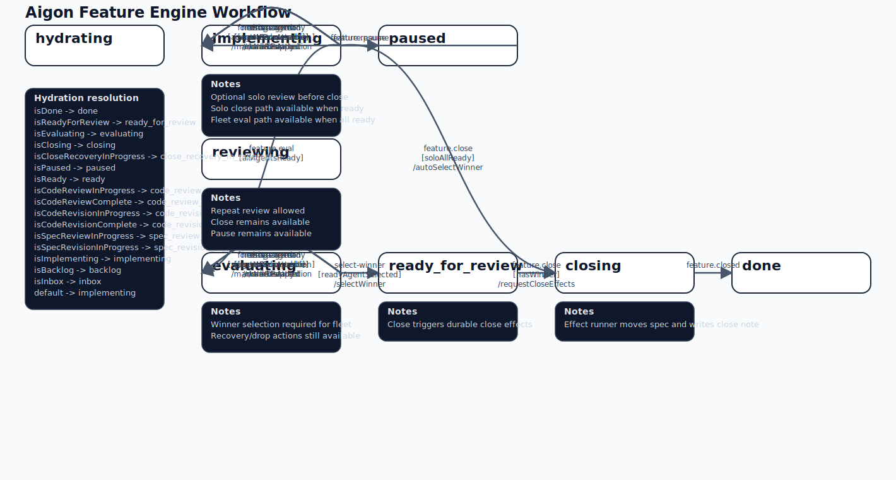
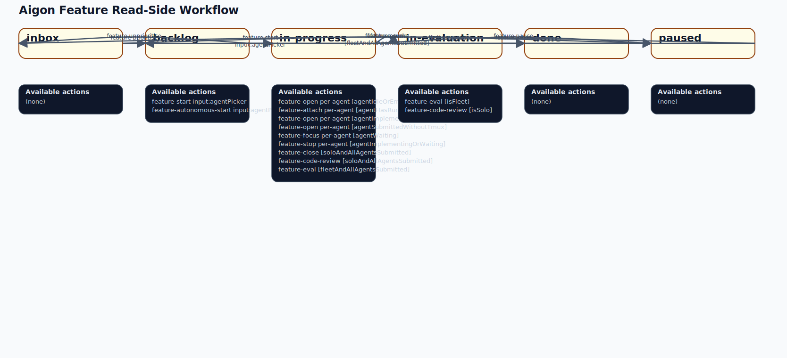
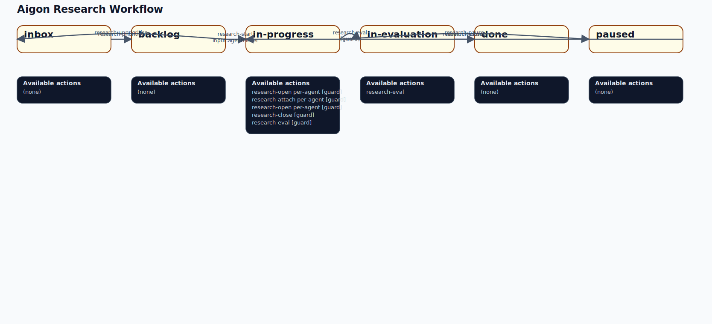
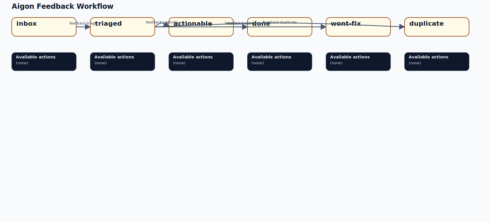

# Aigon Workflow Rules

This document puts the current workflow rules in one place.

It combines:
- feature lifecycle authority from `lib/workflow-core/`
- dashboard/read-side rules from `lib/state-queries.js`
- the practical split between engine truth and UI/action derivation

## Rule Sources

There is not one single rule file today.

The current sources of truth are:
- Feature lifecycle engine: `lib/workflow-core/machine.js`
- Feature action derivation from engine state: `lib/workflow-core/actions.js`
- Feature/research/feedback dashboard rules and fallback logic: `lib/state-queries.js`
- Feature dashboard snapshot/fallback selection: `lib/workflow-read-model.js`

## Generated Diagrams

Generated SVGs live in `docs/generated/workflow/`:
- `feature-engine.svg`
- `feature-readside.svg`
- `research-readside.svg`
- `feedback-readside.svg`

Regenerate them with:

```bash
node scripts/generate-workflow-diagrams.js
```

Check they are current with:

```bash
node scripts/generate-workflow-diagrams.js --check
```

The repo also exposes:

```bash
node aigon-cli.js workflow-rules
node aigon-cli.js workflow-rules --json
```

### Feature Engine Diagram



### Feature Read-Side Diagram



### Research Read-Side Diagram



### Feedback Read-Side Diagram



## Feature Workflow

### Feature Lifecycle Authority

For features, the workflow engine is the authority.

Primary files:
- `lib/workflow-core/machine.js`
- `lib/workflow-core/actions.js`
- `lib/workflow-core/projector.js`
- `lib/workflow-core/engine.js`

### Feature States

Feature engine states:
- `implementing`
- `paused`
- `reviewing`
- `evaluating`
- `ready_for_review`
- `closing`
- `done`

Hydration states:
- `hydrating` is boot-time only
- it resolves immediately into one of the lifecycle states above from projected context

### Feature Guards

Important engine guards:
- `allAgentsReady`: every agent status is `ready`
- `soloAllReady`: non-fleet mode, exactly one agent, that agent is `ready`
- `hasWinner`: `winnerAgentId !== null`
- `readyAgentSelected`: selected agent exists and is `ready`
- `agentRecoverable`: agent status is `lost`, `failed`, or `needs_attention`
- `agentDroppable`: more than one agent exists and target agent is `lost`, `failed`, or `needs_attention`
- `agentNeedsAttention`: agent status is `lost` or `failed`

### Feature Engine Transitions

#### From `implementing`

- `feature.pause` -> `paused`
- `feature.eval` -> `evaluating`
  Condition: `allAgentsReady`
- `feature.review` -> `reviewing`
  Condition: `soloAllReady`
- `feature.close` -> `closing`
  Condition: `soloAllReady`
  Side effect in machine: auto-select winner
- `restart-agent`
  Condition: `agentRecoverable`
- `force-agent-ready`
  Condition: `agentRecoverable`
- `drop-agent`
  Condition: `agentDroppable`
- `needs-attention`
  Condition: `agentNeedsAttention`

#### From `paused`

- `feature.resume` -> `implementing`

#### From `reviewing`

- `feature.close` -> `closing`
  Condition: `soloAllReady`
  Side effect in machine: auto-select winner
- `feature.pause` -> `paused`

#### From `evaluating`

- `select-winner` -> `ready_for_review`
  Condition: `readyAgentSelected`
- `restart-agent`
  Condition: `agentRecoverable`
- `force-agent-ready`
  Condition: `agentRecoverable`
- `drop-agent`
  Condition: `agentDroppable`
- `needs-attention`
  Condition: `agentNeedsAttention`

#### From `ready_for_review`

- `feature.close` -> `closing`
  Condition: `hasWinner`

#### From `closing`

- `feature.closed` -> `done`

#### From `done`

- terminal state

### Feature Actions Exposed By The Engine

Derived in `lib/workflow-core/actions.js` via `snapshot.can(...)`.

Candidate actions:
- `pause-feature`
- `resume-feature`
- `feature-eval`
  Fleet only
- `feature-close`
- `feature-review`
  Solo only
- `restart-agent`
- `force-agent-ready`
- `drop-agent`
- `select-winner`

Practical behavior:
- fleet features typically go `implementing -> evaluating -> ready_for_review -> closing -> done`
- solo/Drive features can go `implementing -> reviewing -> closing -> done`
- solo/Drive features can also go `implementing -> closing -> done` directly when the single agent is ready

### Feature Runtime/Status Model

The engine owns lifecycle.

The dashboard still combines runtime inputs from several places:
- workflow snapshot in `.aigon/workflows/features/{id}/snapshot.json`
- engine events in `.aigon/workflows/features/{id}/events.jsonl`
- per-agent status files in `.aigon/state/feature-{id}-{agent}.json`
- tmux session detection
- worktree detection
- compatibility fallback reads for older repos

Current read-side modules:
- `lib/workflow-snapshot-adapter.js`
- `lib/workflow-read-model.js`
- `lib/dashboard-status-collector.js`
- `lib/dashboard-status-helpers.js`

## Dashboard Feature Rules

These are the dashboard/read-side rules in `lib/state-queries.js`.

They are not the lifecycle authority for features, but they still matter because they drive UI actions and fallback behavior.

### Feature Stages

Dashboard feature stages:
- `inbox`
- `backlog`
- `in-progress`
- `in-evaluation`
- `done`
- `paused`

### Feature Stage Transitions

- `inbox -> backlog`
  Action: `feature-prioritise`
- `backlog -> in-progress`
  Action: `feature-start`
  Requires input: `agentPicker`
- `in-progress -> in-evaluation`
  Action: `feature-eval`
  Condition: fleet mode and all agents submitted
- `in-evaluation -> done`
  Action: `feature-close`
- `inbox -> paused`
  Action: `feature-pause`
- `backlog -> paused`
  Action: `feature-pause`
- `in-progress -> paused`
  Action: `feature-pause`
- `paused -> backlog`
  Action: `feature-resume`
- `paused -> inbox`
  Action: `feature-resume`

### Feature In-State Actions

From `in-progress`:
- `feature-open`
  Per-agent
  Shown when agent is `idle`, `error`, or absent
- `feature-attach`
  Per-agent
  Shown when agent is `implementing` or `submitted` and tmux is running
- `feature-open`
  Per-agent
  Shown when agent is `implementing` and tmux is not running
- `feature-focus`
  Per-agent
  Shown when agent is `waiting`
- `feature-stop`
  Per-agent
  Shown when agent is `implementing` or `waiting`
- `feature-close`
  Solo only
  Shown when all agents are submitted
- `feature-review`
  Solo only
  Shown when all agents are submitted
- `feature-eval`
  Fleet only
  Shown when all agents are submitted
- `feature-autonomous-start`
  Shown when no tmux sessions are running

From `in-evaluation`:
- `feature-eval`
  Fleet only
  Label: Continue Evaluation
- `feature-review`
  Solo only

From `backlog`:
- `feature-start`
  Requires input: `agentPicker`
- `feature-autonomous-start`
  Requires input: `agentPicker`

## Research Workflow

Research does not use `workflow-core`.

Authority:
- spec folder location
- command logic
- dashboard/read-side rules in `lib/state-queries.js`

### Research Stages

- `inbox`
- `backlog`
- `in-progress`
- `in-evaluation`
- `done`
- `paused`

### Research Transitions

- `inbox -> backlog`
  Action: `research-prioritise`
- `backlog -> in-progress`
  Action: `research-start`
  Requires input: `agentPicker`
- `in-progress -> in-evaluation`
  Action: `research-eval`
  Condition: all agents submitted
- `in-evaluation -> done`
  Action: `research-close`
- `in-progress -> paused`
  Action: `research-pause`
- `paused -> in-progress`
  Action: `research-resume`

### Research In-State Actions

From `in-progress`:
- `research-open`
  Per-agent
  Shown when agent is `idle`, `error`, or absent
- `research-attach`
  Per-agent
  Shown when agent is `implementing` or `submitted` and tmux is running
- `research-open`
  Per-agent
  Shown when agent is `implementing` and tmux is not running
- `research-close`
  Solo only
  Shown when all agents are submitted
- `research-eval`
  Fleet only
  Shown when all agents are submitted

From `in-evaluation`:
- `research-eval`
  Label: Synthesize Findings

## Feedback Workflow

Feedback also does not use `workflow-core`.

Authority:
- spec folder location
- command logic
- dashboard/read-side rules in `lib/state-queries.js`

### Feedback Stages

- `inbox`
- `triaged`
- `actionable`
- `done`
- `wont-fix`
- `duplicate`

### Feedback Transitions

- `inbox -> triaged`
  Action: `feedback-triage`
- `triaged -> actionable`
  Action: `feedback-promote`
- `triaged -> wont-fix`
  Action: `feedback-wont-fix`
- `triaged -> duplicate`
  Action: `feedback-duplicate`
- `actionable -> done`
  Action: `feedback-close`

### Feedback In-State Actions

- none defined in `lib/state-queries.js`
- only stage transitions are exposed

## Session Rules

Read-side session behavior from `lib/state-queries.js`:

- if tmux session state is `none` or `exited`
  result: `create-and-start`
- if agent status is `implementing` or `waiting`
  result: `attach`
- otherwise
  result: `send-keys`

This is used to decide whether the dashboard opens a new session, attaches to an existing one, or injects a fresh command into a live session.

## Current Architectural Reality

The workflow is easier to reason about if you split it this way:

### Feature lifecycle truth

- owned by `lib/workflow-core/`
- event-sourced
- machine-guarded
- durable effects for close/move-spec

### Runtime/session truth

- owned by status files, tmux state, worktree state, and dashboard readers

### Research/feedback truth

- still folder-based and command-driven

### Dashboard action truth

- mix of engine-derived actions and `state-queries.js` rules

## Recommended Reading Order

If you want to inspect the actual implementation behind this summary:

1. `lib/workflow-core/machine.js`
2. `lib/workflow-core/actions.js`
3. `lib/workflow-core/engine.js`
4. `lib/state-queries.js`
5. `lib/workflow-read-model.js`
6. `lib/dashboard-status-collector.js`

## Known Gaps

These are the rule-system mismatches that still make the code harder to trust:

- feature lifecycle rules live in the engine, but dashboard fallback rules still exist separately
- research and feedback still use a different rule model from features
- some runtime/session concepts are outside the engine entirely, so the dashboard must merge multiple data sources

That means this document is a consolidated map of the current system, not evidence that the system is fully unified yet.
