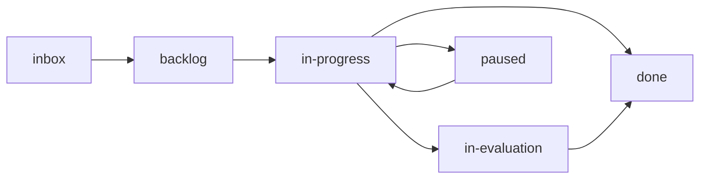
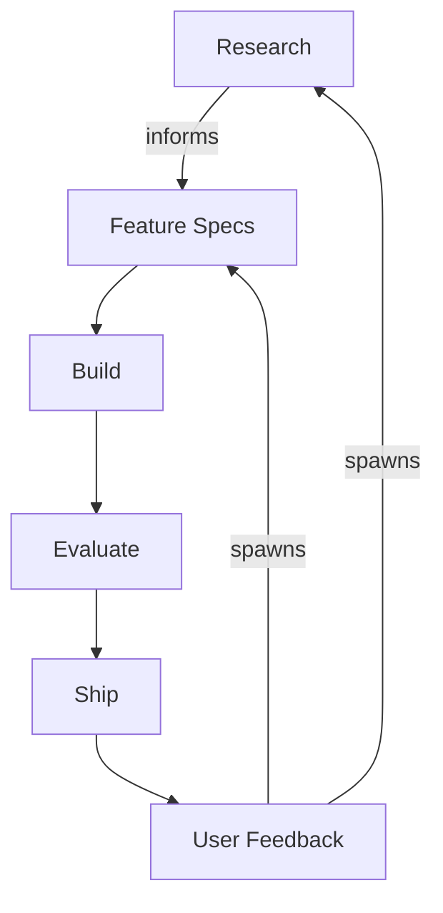

Aigon stores all workflow state as files in your repository. Features, research topics, and feedback items move through folders that represent their lifecycle stage.

## Core principles

- **State-as-Folders**: Task status is defined by *where it lives* (`inbox`, `backlog`, `in-progress`), not by database records
- **Decoupled Lifecycles**: Research explores *what* to build; Features define *how* to build it
- **Traceable History**: All agent conversations and implementation attempts are preserved as Markdown files

## Directory layout

```
your-repo/
├── .agents/              # Codex Skills (.agents/skills/aigon-*/SKILL.md)
├── .aigon/               # Local runtime state (gitignored)
├── .claude/              # Claude Code config + aigon commands
├── .codex/               # Codex config (config.toml only)
├── .cursor/              # Cursor config + aigon commands
├── .gemini/              # Gemini CLI config + aigon commands
├── .githooks/            # Git hooks (merge gate scanning)
├── docs/
│   ├── agents/           # Per-agent orientation notes
│   └── specs/
│       ├── features/     # Delivery pipeline
│       │   ├── 01-inbox/
│       │   ├── 02-backlog/
│       │   ├── 03-in-progress/
│       │   ├── 04-in-evaluation/
│       │   ├── 05-done/
│       │   ├── 06-paused/
│       │   ├── evaluations/
│       │   └── logs/
│       ├── research-topics/  # Discovery pipeline
│       │   ├── 01-inbox/
│       │   ├── 02-backlog/
│       │   ├── 03-in-progress/
│       │   ├── 04-in-evaluation/
│       │   ├── 05-done/
│       │   ├── 06-paused/
│       │   └── logs/
│       └── feedback/     # Triage pipeline
│           ├── 01-inbox/
│           ├── 02-triaged/
│           ├── 03-actionable/
│           ├── 04-done/
│           ├── 05-wont-fix/
│           └── 06-duplicate/
└── AGENTS.md             # Shared agent orientation (all agents read this)
```

### Lifecycle folders (Kanban)

**Features & Research**

| Folder | Purpose |
|--------|---------|
| `01-inbox/` | New, unprioritised items |
| `02-backlog/` | Prioritised, assigned an ID |
| `03-in-progress/` | Currently being worked on |
| `04-in-evaluation/` | Submitted, pending evaluation (Fleet) |
| `05-done/` | Merged and complete |
| `06-paused/` | Temporarily on hold |

**Feedback**

| Folder | Purpose |
|--------|---------|
| `01-inbox/` | New, unreviewed feedback |
| `02-triaged/` | Classified and validated |
| `03-actionable/` | Ready to promote to a feature or research topic |
| `04-done/` | Resolved |
| `05-wont-fix/` | Acknowledged, not actioned |
| `06-duplicate/` | Duplicate of an existing item |

### Supporting files

- **`logs/`** — Implementation logs (selected winners + alternatives)
- **`evaluations/`** — Fleet comparison reports

## Naming conventions

| Stage | Pattern | Example |
|-------|---------|---------|
| Draft (inbox) | `feature-description.md` | `feature-dark-mode.md` |
| Prioritised | `feature-{ID}-description.md` | `feature-55-dark-mode.md` |
| Agent-specific (Fleet) | `feature-{ID}-{agent}-description-log.md` | `feature-55-cc-dark-mode-log.md` |

## State machine

Specs transition through states via the `requestTransition()` gatekeeper. You cannot skip steps — the state machine enforces valid transitions.



All transitions go through the CLI — never move spec files manually.

## The `.aigon/` directory

Local runtime state lives in `.aigon/` (gitignored). Spec folders in `docs/specs/` are the committed, human-readable view; `.aigon/` is the engine underneath.

| Path | Purpose |
|------|---------|
| `.aigon/config.json` | Project-level configuration |
| `.aigon/state/feature-{id}.json` | Per-feature status (created by CLI) |
| `.aigon/state/feature-{id}-{agent}.json` | Per-agent status files (heartbeat, session metadata) |
| `.aigon/workflows/features/{id}/events.jsonl` | Append-only workflow event log |
| `.aigon/workflows/features/{id}/snapshot.json` | Derived workflow snapshot |
| `.aigon/telemetry/` | Normalised per-session telemetry records (agent, model, tokens, cost, duration) |
| `.aigon/cache/` | Cached data (e.g. `commits.json` for commit analytics) |

Run `aigon doctor --fix` to detect and repair desyncs between spec folders and engine state.

## The complete lifecycle loop



**Forward traceability**: "Feature #108 addresses feedback #42 and was informed by research #07"

**Backward traceability**: "Feedback #42 resulted in feature #108, shipped in v2.1"
