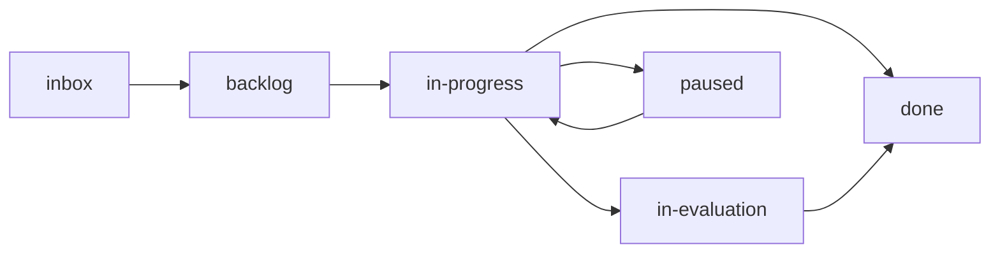
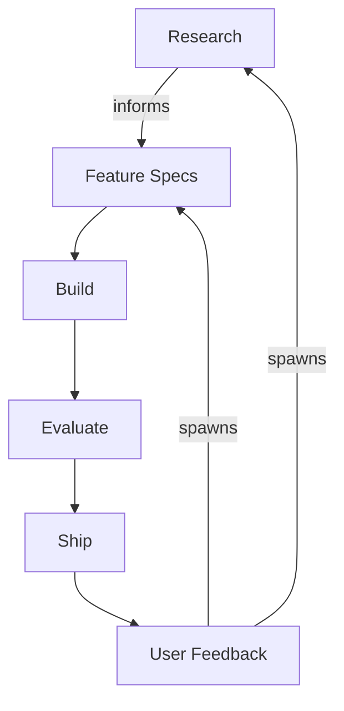

Aigon stores all workflow state as files in your repository. Features, research topics, and feedback items move through folders that represent their lifecycle stage.

## Core principles

- **State-as-Folders**: Task status is defined by *where it lives* (`inbox`, `backlog`, `in-progress`), not by database records
- **Decoupled Lifecycles**: Research explores *what* to build; Features define *how* to build it
- **Traceable History**: All agent conversations and implementation attempts are preserved as Markdown files

## Directory layout

All workflow state lives in `docs/specs/`, organised into three areas:

- **`features/`** — Implementation specs with acceptance criteria (the delivery pipeline)
- **`research-topics/`** — Investigations exploring technical possibilities (the discovery pipeline)
- **`feedback/`** — User input, bugs, and improvement ideas (the triage pipeline)

### Lifecycle folders (Kanban)

**Features & Research**

| Folder | Purpose |
|--------|---------|
| `01-inbox/` | New, unprioritised items |
| `02-backlog/` | Prioritised, assigned an ID |
| `03-in-progress/` | Currently being worked on |
| `04-in-evaluation/` | Submitted, pending evaluation (Fleet) |
| `05-done/` | Merged and complete |
| `06-paused/` | Temporarily on hold |

**Feedback**

| Folder | Purpose |
|--------|---------|
| `01-inbox/` | New, unreviewed feedback |
| `02-triaged/` | Classified and validated |
| `03-actionable/` | Ready to promote to a feature or research topic |
| `04-done/` | Resolved |
| `05-wont-fix/` | Acknowledged, not actioned |
| `06-duplicate/` | Duplicate of an existing item |

### Supporting files

- **`logs/`** — Implementation logs (selected winners + alternatives)
- **`evaluations/`** — Fleet comparison reports

## Naming conventions

| Stage | Pattern | Example |
|-------|---------|---------|
| Draft (inbox) | `feature-description.md` | `feature-dark-mode.md` |
| Prioritised | `feature-{ID}-description.md` | `feature-55-dark-mode.md` |
| Agent-specific (Fleet) | `feature-{ID}-{agent}-description-log.md` | `feature-55-cc-dark-mode-log.md` |

## State machine

Specs transition through states via the `requestTransition()` gatekeeper. You cannot skip steps — the state machine enforces valid transitions.

All transitions go through the CLI — never move spec files manually.

## Manifests (local reliability layer)

Feature/research state lives in two layers:

1. **Folders** (`docs/specs/features/03-in-progress/`) — shared ground truth, committed to Git
2. **Manifests** (`.aigon/state/feature-{id}.json`) — local reliability layer, gitignored, crash-safe

Agents write status to `.aigon/state/feature-{id}-{agent}.json` in the main repo (not inside worktrees). Run `aigon doctor --fix` to detect and repair desyncs between the two layers.

### Additional `.aigon/` directories

| Directory | Purpose |
|-----------|---------|
| `.aigon/state/` | Per-feature manifests and per-agent status files (gitignored) |
| `.aigon/cache/` | Cached data (e.g., `commits.json` for commit analytics) |
| `.aigon/telemetry/` | Normalized per-session telemetry records (agent, model, tokens, cost, duration) |
| `.aigon/config.json` | Project-level configuration |

## The complete lifecycle loop

**Forward traceability**: "Feature #108 addresses feedback #42 and was informed by research #07"

**Backward traceability**: "Feedback #42 resulted in feature #108, shipped in v2.1"
