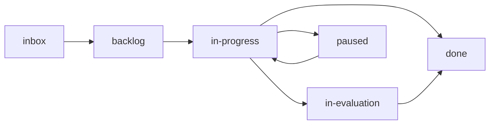
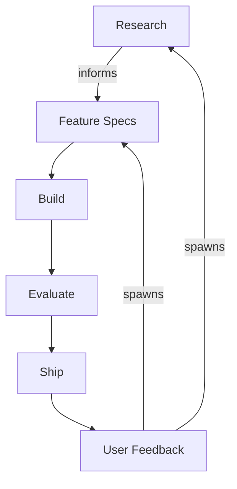

Aigon stores workflow state through SpecStore. Human-readable specs live in your repository under `docs/specs/`; the authoritative feature/research lifecycle is the workflow-core event log. By default that event log is local under `.aigon/workflows/`; with git-branch storage enabled, canonical events live on the configured state branch and `.aigon/workflows/` becomes a local projection cache.

## Core principles

- **Engine-first lifecycle**: feature and research status comes from workflow-core snapshots; folders are a user-visible projection.
- **Decoupled lifecycles**: research explores what to build; features define how to build it.
- **Traceable history**: workflow events, snapshots, telemetry, specs, and logs stay inspectable from the repo checkout. Git-branch storage can synchronise canonical workflow, lease, and stats events across clones.

## Source of truth

| Question | Source of truth | Notes |
|----------|-----------------|-------|
| What does the human-readable spec say? | Canonical Markdown under `docs/specs/.../00-specs/` in stable layout, or the legacy lifecycle folder | Specs are committed Markdown and remain the reviewable artifact. |
| What lifecycle state is a feature or research topic in? | SpecStore events: local `.aigon/workflows/<type>/<id>/events.jsonl` or `specs/<key>/events.jsonl` on the git-branch state branch | Workflow-core is authoritative. |
| Which clone holds an active lease? | A git-branch lease file at `leases/<key>.json`; local backend uses advisory events | Dashboard details, `aigon storage report`, and `aigon board --storage` surface active leases. |
| Which Kanban column should I see? | Generated lifecycle view from workflow state | Do not manually move files or links to change lifecycle state. |
| What is an agent doing right now? | `.aigon/state/*`, `.aigon/sessions/*`, and live `tmux` state | Runtime/session state is transient and separate from lifecycle truth. |
| What happened in an agent run? | Logs under `docs/specs/**/logs/`, transcript references in `.aigon/sessions/*.json`, durable transcript copies under `~/.aigon/transcripts/`, and telemetry under `.aigon/telemetry/` | Useful for review and analytics; not the lifecycle authority. |

## Directory layout

New repositories use the stable layout. Canonical spec Markdown is kept in `00-specs/`; generated lifecycle links provide the familiar Kanban folders.

```
your-repo/
├── .agents/              # Codex skills installed by Aigon
├── .aigon/               # Local runtime state + Aigon-owned docs (mostly gitignored)
├── .claude/              # Claude Code config + Aigon commands
├── .codex/               # Codex config
├── .cursor/              # Cursor config + Aigon commands
├── .githooks/            # Git hooks
├── docs/
│   └── specs/
│       ├── features/
│       │   ├── 00-specs/         # Canonical feature Markdown
│       │   ├── 01-inbox/         # Generated lifecycle links
│       │   ├── 02-backlog/
│       │   ├── 03-in-progress/
│       │   ├── 04-in-evaluation/
│       │   ├── 05-done/
│       │   ├── 06-paused/
│       │   ├── evaluations/
│       │   └── logs/
│       ├── research-topics/
│       │   ├── 00-specs/         # Canonical research Markdown
│       │   ├── 01-inbox/ … 06-paused/  # Generated lifecycle links
│       │   └── logs/
│       └── feedback/              # Legacy feedback pipeline
├── AGENTS.md             # Optional user-owned shared agent orientation
└── CLAUDE.md             # Optional user-owned Claude Code instructions
```

### Lifecycle folders

| Folder | Purpose |
|--------|---------|
| `01-inbox/` | New, unprioritised items |
| `02-backlog/` | Prioritised items |
| `03-in-progress/` | Currently being worked on |
| `04-in-evaluation/` | Submitted, pending evaluation |
| `05-done/` | Merged and complete |
| `06-paused/` | Temporarily on hold |

Under `specLayout: "stable"`, these are generated symlinks rather than canonical files. They are disposable: inspect them with `aigon spec-view status`, and repair only Aigon-managed links with `aigon spec-view refresh`.

Existing repositories can retain the legacy stage-folder layout. Run `aigon spec-layout status` to see which layout a repository uses; migration is always explicit.

## State machine

Feature and research specs transition through workflow-core. Events are appended to the local SpecStore log or synchronised to the configured git-branch state branch; snapshots are derived from those events and the state machine validates lifecycle transitions.



All transitions should go through Aigon commands or dashboard actions. Do not move spec files manually to change state. For stable layouts, use [`spec-layout`](/docs/reference/commands/infra/spec-layout) and [`spec-view`](/docs/reference/commands/infra/spec-view); for storage diagnostics, use `aigon storage doctor`.

## The `.aigon/` directory

Local runtime state lives in `.aigon/` (gitignored). It is the canonical event location for local storage and a disposable projection for git-branch storage. Spec Markdown and code continue to use normal Git in both cases.

| Path | Purpose |
|------|---------|
| `.aigon/config.json` | Project-level configuration, including storage backend and spec layout |
| `.aigon/docs/` | Aigon-installed operational docs |
| `.aigon/install-manifest.json` | Tracks Aigon-owned installed files |
| `.aigon/state/feature-{id}-{agent}.json` | Per-agent status files (heartbeat, session metadata) |
| `.aigon/workflows/features/{id}/events.jsonl` | Local append-only event log or git-branch projection |
| `.aigon/workflows/features/{id}/snapshot.json` | Derived local workflow snapshot |
| `.aigon/workflows/features/{id}/stats.json` | Local stats projection rebuilt from canonical stats where available |
| `.aigon/telemetry/` | Normalised per-session telemetry records |
| `.aigon/cache/` | Cached data, including aggregate stats |

With `storage.backend: "git-branch"`, canonical state is a file tree on the configured branch (default: `aigon-state`): `meta.json`, `specs/<key>/events.jsonl`, and `leases/<key>.json`.

For cross-machine workflow state, see [Storage Backends](/docs/reference/storage-backends).

## The complete lifecycle loop


